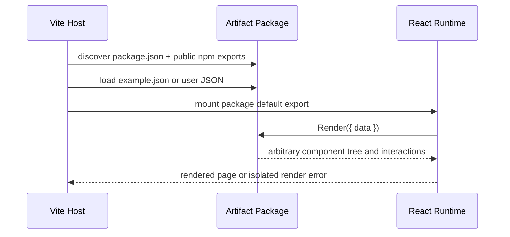

# Architecture

## Repository layers

```text
apps/*       = runnable hosts and services
packages/*   = reusable libraries with demonstrated cross-package value
packages/artifact-* = source-published Artifact Packages
e2e/*        = package format and assembled runtime tests
evals/*      = evaluations that call real models
docs/*       = durable product and format knowledge
scripts/*    = local automation
```

`packages/artifact-*` follows the repository's reusable-package boundary. Each matching directory is
an independent publication and fork boundary.

## Runtime seam



The interface is deliberately one-way in v0. There is no Host SDK or callback prop. This keeps the
module deep: one `data` prop unlocks an entire React implementation while changes remain local to the
package.

## Discovery

At startup, a concrete Vite plugin scans `packages/artifact-*` manifests and builds a virtual catalog
whose imports use four public npm exports:

```text
@scope/name
@scope/name/schema
@scope/name/example
@scope/name/package.json
```

This is a concrete local implementation, not an abstract registry port. Copying a package requires
`npm install` and a Host restart so the workspace link and virtual catalog can refresh. A remote
registry should introduce a new adapter only when it exists.

## Dependency ownership

- The host owns React and ReactDOM.
- An Artifact Package lists React as a peer dependency.
- Each Artifact Package owns its visualization, state, layout, and asset dependencies.
- Artifact Packages do not import `apps/web`, sibling renders, or hidden workspace helpers.
- No shared render UI package exists until two real packages need the same implementation.

`decision-board` and `evidence-trace` are two concrete adapters on the same seam, so the interface is
demonstrated rather than hypothetical.

## Trust boundary

v0 executes trusted source in the host page. Package metadata is descriptive, not a security policy.
It does not isolate DOM, CSS, network, storage, cookies, or global state. Unknown package execution
requires a separate iframe, WebContainer, or remote sandbox design and must not be inferred from the
current format.

## Error boundary

Discovery and dependency errors fail the build or prevent a package from entering the catalog. JSON
syntax errors retain the last valid input. React render errors are contained inside the preview panel
so the package catalog and editor remain usable.
