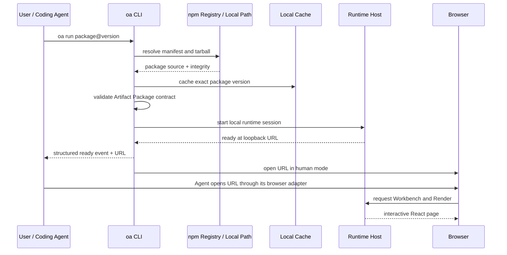
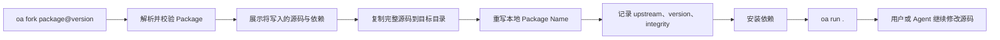

# Open Artifacts 产品定位：以 `oa` CLI 为核心

> 状态：产品方向草案，2026-07-14  
> 若本文与 `docs/product-brief.md` 的 Host-first 描述冲突，以本文的 CLI-first 定位为准。
> 外部项目证据与对比来源见 [`docs/research.md`](research.md)。

## 一句话定位

> **Open Artifacts 是面向 Coding Agent 的 source-first Artifact Package Runtime。一个 `oa run` 命令把版本化 Artifact Package 变成本地交互页面，一个 `oa fork` 命令把它变成用户拥有的源码。**

Open Artifacts 不负责替代 Agent 生成内容，也不负责发明另一种 Generative UI DSL。它负责 Agent 与一个可运行、可审计、可复现、可 fork 的 Web Artifact 之间缺失的本地运行层。

## 产品核心已经改变

之前的实现把 Workbench 当作产品入口：它扫描 monorepo 中的 `packages/artifact-*`，展示 Package 列表，并把右侧 JSON 传给 React Render。

新的定位应当把层级倒过来：

```text
oa CLI             = 产品入口和生命周期管理器
Artifact Package   = 核心分发单位
Local Runtime      = oa 启动的执行环境
Workbench          = Runtime 提供的浏览器界面
Agent Adapter      = 帮 Agent 调用 oa 并打开 URL
```

Workbench 仍然有价值，但它应成为 `oa run` 启动后用户看到的页面，而不是要求所有 Artifact Package 先加入 Open Artifacts monorepo。

## 产品承诺

对用户：

> 给我一个 Artifact Package 名称，我可以一条命令在本地看到它；如果想改，我可以一条命令拿到完整源码。

对 Agent：

> 给我一个 Package Specifier，我会返回稳定、机器可读的本地 URL 和运行状态；你可以用浏览器工具打开、检查和继续修改它。

对 Package 作者：

> 只要发布一个符合 Artifact Package Contract 的普通 npm 源码包，就能被不同 Agent 和本地 Host 运行，不需要绑定某家模型或聊天产品。

## 核心工作流

### 运行一个 Artifact



用户可见命令：

```bash
oa run @open-artifacts/decision-board@0.1.0
```

这条命令内部完成：

1. 解析 Package Specifier；
2. 下载并缓存精确版本；
3. 校验 `openArtifacts.format`、exports、Schema 和 Example；
4. 准备依赖与 Runtime；
5. 仅绑定本机 loopback 地址并启动 Server；
6. 打开系统浏览器，或向 Agent 输出机器可读 URL；
7. 在进程结束时清理临时运行环境，但保留内容寻址缓存。

### Fork 一个 Artifact



用户可见命令：

```bash
oa fork @open-artifacts/decision-board@0.1.0 ./my-decision-board
cd my-decision-board
oa run .
```

Fork 的语义不是 GitHub Fork，而是“把远程 Package 物化为本地、独立、可继续发布的源码工程”。Fork 后不依赖原来的 Open Artifacts monorepo，也不需要修改 Host Registry。

## 核心对象

| 对象              | 责任                                                | 不负责                        |
| ----------------- | --------------------------------------------------- | ----------------------------- |
| Artifact Package  | React 源码、Schema、Example、样式、资源、依赖、版本 | 某一次用户数据和 Runtime 进程 |
| Artifact Input    | 某次渲染使用的 JSON 数据                            | React 实现和依赖              |
| Package Specifier | 指向 Package 名称、版本或本地路径                   | 保存源码副本                  |
| Runtime Session   | Server、端口、URL、日志、进程状态                   | 长期保存源码                  |
| Fork Workspace    | 用户拥有的完整 Package 源码                         | 自动追踪上游更新              |
| Agent Adapter     | 调用 CLI、解析事件、使用浏览器工具打开 URL          | 定义 Package 格式             |

## Artifact Package Contract

v0 继续采用当前 source-first npm Contract，不另造包管理格式：

```text
artifact-package/
├── package.json
├── README.md
├── input.schema.json
├── example.json
├── tsconfig.json
└── src/
    └── index.tsx
```

`package.json` 是唯一 manifest：

```json
{
  "name": "@scope/example",
  "version": "0.1.0",
  "type": "module",
  "exports": {
    ".": "./src/index.tsx",
    "./schema": "./input.schema.json",
    "./example": "./example.json",
    "./package.json": "./package.json"
  },
  "openArtifacts": {
    "format": "react-render/v0"
  },
  "peerDependencies": {
    "react": "^19.0.0"
  }
}
```

默认导出仍然只有一个深接口：

```tsx
export default function Render({ data }: { data: MyInput }) {
  return <main />;
}
```

Package 可以使用 ECharts、Three.js、React Flow、TanStack Table 等 React 生态依赖。依赖属于 Package，不属于 Workbench。

## CLI 最小命令面

首版只需要两个主命令。

### `oa run`

```text
oa run <specifier> [options]
```

建议首版支持的 Specifier：

```text
@scope/package@version    npm 精确版本或 dist-tag
./local-package           本地开发目录
/absolute/package         本地绝对路径
```

建议参数：

| 参数                   | 作用                                  |
| ---------------------- | ------------------------------------- |
| `--input <file>`       | 使用指定 JSON，而不是 Package Example |
| `--port <number>`      | 指定端口；默认自动选择空闲端口        |
| `--open` / `--no-open` | 控制是否打开系统浏览器                |
| `--json`               | 输出 Agent 可解析的 JSON Lines 事件   |
| `--refresh`            | 忽略缓存，重新解析远程版本            |

默认交互模式应打印简洁日志并打开浏览器；Agent 模式使用 `--json --no-open`：

```json
{
  "type": "ready",
  "package": "@scope/example",
  "version": "0.1.0",
  "url": "http://127.0.0.1:43127/",
  "pid": 12345
}
```

### `oa fork`

```text
oa fork <specifier> [directory] [options]
```

建议参数：

| 参数                    | 作用                           |
| ----------------------- | ------------------------------ |
| `--name <package-name>` | 指定 fork 后的新 npm name      |
| `--dry-run`             | 只显示将复制的文件、依赖和来源 |
| `--force`               | 明确允许写入非空目标目录       |
| `--no-install`          | 只物化源码，不安装依赖         |

Fork 目录应在 `.oa/upstream.json` 中记录最少 provenance：

```json
{
  "upstream": "@scope/example@0.1.0",
  "integrity": "sha512-...",
  "forkedAt": "2026-07-14T00:00:00.000Z"
}
```

这个旁路文件不改变 `react-render/v0` Artifact Package Contract，也不需要首版设计完整的依赖 lockfile 或上游合并协议。

### 首版不要加入的命令

以下命令都可能有价值，但不是验证核心闭环所必需：

- `oa search`、`oa browse`：需要自建 Registry 或索引；
- `oa publish`：npm 已经提供发布能力；
- `oa deploy`：会把产品带入托管平台；
- `oa generate`：会把 CLI 绑定到模型编排；
- `oa annotate`：不是当前核心；
- `oa update`：需要先定义 fork 与 upstream merge 语义。

## Agent 集成方式

“让 Agent 在浏览器中打开页面”不应等于把 Codex、Claude Code 或 Cursor 的私有 Browser API 写进 `oa` CLI。

建议分成两层：

```text
oa CLI
    -> 输出稳定 JSON Ready Event
Agent Skill / MCP Adapter
    -> 调用 oa run --json --no-open
    -> 读取 URL
    -> 调用该 Agent 自己的 Browser Tool
```

人类直接执行 `oa run` 时，CLI 默认调用系统浏览器。Agent 执行时，Adapter 负责让 Agent 真正“看到”页面。这样 CLI 保持 Agent-neutral，同时能对 Codex、Claude Code、Cursor、OpenCode 等分别提供很薄的集成层。

首版可以随 CLI 一起发布一个标准 Agent Skill，描述：

1. 如何运行 Package；
2. 如何等待 `ready` 事件；
3. 如何打开 URL；
4. 如何在修改源码后重新检查；
5. 何时使用 `oa fork`。

MCP Adapter 是后续兼容层，不应阻塞 CLI MVP。

## Local-first 不等于安全

`oa run` 会下载第三方源码和依赖，并在本地浏览器中执行。这个安全风险必须进入产品合同，而不是留给 README 脚注。

v0 建议明确只支持 trusted Package，并采取以下默认措施：

- 远程 Package 首次运行前显示 name、version、来源、integrity 和依赖；
- 安装依赖默认禁用 lifecycle scripts；
- Server 默认只绑定 `127.0.0.1`，不暴露到局域网；
- 不把用户环境变量、文件系统目录或 Agent 凭据注入前端；
- 每个 Runtime Session 使用独立 origin 或随机端口；
- Package CSS 与 DOM 目前不隔离，UI 中必须标注 trusted execution；
- `oa fork --dry-run` 可以在写入前检查文件与依赖；
- 缓存使用 Registry integrity 校验，不执行可变的未锁定内容。

未知第三方 Package 的 iframe、WebContainer 或远程 sandbox 属于后续 Runtime，不应在 v0 中假装已经解决。

## 产品边界

Open Artifacts 是：

- Artifact Package Resolver；
- 本地 React Source Runtime；
- 可复现的 CLI Session Manager；
- 源码 Fork 工具；
- Agent 可以调用的浏览器交付原语。

Open Artifacts 不是：

- 新的 Coding Agent；
- 在线 IDE；
- 模型 Router 或 Prompt Workflow；
- A2UI/json-render 的替代 DSL；
- React Component Library；
- 云端部署平台；
- 协作、账号和计费系统；
- Annotation 产品。

## 与现有产品的定位差异

| 产品                   | 核心单位                    | 核心动作           | Open Artifacts 不同在哪里                 |
| ---------------------- | --------------------------- | ------------------ | ----------------------------------------- |
| Claude Artifact Runner | 单个 TSX 文件               | run/build/create   | OA 运行版本化、依赖自包含的源码 Package   |
| shadcn                 | Component Registry Item     | add source         | OA 的源码 Item 本身就是可运行页面         |
| MCP Apps               | Tool 关联 HTML Resource     | Host fetch/render  | OA 管理本地源码、版本、运行和 fork        |
| json-render/A2UI       | 结构化 UI Spec              | render spec        | OA 不限制 Package 内部的 React 表达力     |
| Open Design            | 完整 Agent Design Workspace | create/edit/export | OA 是可嵌入的底层 Runtime，而不是创作套件 |
| Storybook              | Component Story             | develop/test       | OA 面向可下载 Artifact 和 Coding Agent    |

## 第一位用户

第一位用户不是普通终端消费者，而是正在使用 Codex、Claude Code、Cursor 或 OpenCode 的 AI Builder：

> Agent 给我一个结果时，我不想只收到 Markdown，也不想得到一坨只能在某家云产品里运行的临时代码。我希望 Agent 交给我一个可复现的 Package，本地一条命令打开，需要时直接 fork 源码。

这个用户已经拥有 Node、终端和 Coding Agent，能够接受 npm Package 作为 v0 分发载体，也最能理解“源码所有权”的价值。

## MVP 验收标准

第一版只需要证明以下五件事：

1. 在一个空目录执行 `npx @open-artifacts/cli run @open-artifacts/decision-board@0.1.0`，CLI 能下载 Package、启动 Server 并打开正确页面；
2. 第二次运行同一精确版本会复用完整性校验后的缓存；
3. `oa fork <specifier> ./my-render` 生成一个不依赖 Open Artifacts monorepo 的独立源码目录；
4. 在 fork 目录执行 `oa run .` 能运行修改后的源码和 Package 自有依赖；
5. Codex 或 Claude Code 能通过 JSON 输出取得 URL，并使用自己的 Browser Tool 打开页面。

对应的最小自动化验证：

- Package Contract Test；
- Registry Tarball Download Test；
- Cache Hit Test；
- Local Server Readiness Test；
- Fork Independence Test；
- JSON Event Contract Test。

## 从当前实现迁移

当前代码已经验证了 Artifact Package Contract 和 React Runtime seam，但还没有 CLI。建议保留有效部分，并改变装配方式：

```text
当前
apps/web 启动
    -> 扫描仓库 packages/artifact-*
    -> 一次加载全部 Package

目标
oa run <specifier>
    -> resolve 单个 Package
    -> 创建临时 Runtime Workspace
    -> 将 Package 注入 Host
    -> 启动 apps/web Runtime
```

建议的代码边界：

```text
packages/cli/          oa 参数、resolve、cache、run、fork、JSON events
packages/runtime/      Vite Host 创建与 Server 生命周期
apps/web/              浏览器 Workbench UI
packages/artifact-*/     本仓库内的 Contract fixtures 和官方示例
```

第一步不需要重写 Workbench。只需要让它从 CLI 传入的单个 Package 入口加载，而不是扫描固定 monorepo 目录。

## 发布与命名

npm 的非 scoped 包名 `oa` 已被占用。建议：

```text
npm package: @open-artifacts/cli
binary name: oa
```

使用方式：

```bash
npx @open-artifacts/cli run <specifier>
npm install -g @open-artifacts/cli
oa run <specifier>
```

同时，社区已经存在另一个名为 OpenArtifacts 的 Claude Artifact 浏览器克隆。CLI MVP 开发可以继续使用当前名称，但公开发布前应完成一次名称与 npm scope 决策，避免在产品成熟后再承担迁移成本。

## 推荐路线

### Phase 1：证明 CLI 闭环

- `oa run <local-path>`；
- `oa run <npm-package@version>`；
- 自动端口、本地 Server、浏览器打开；
- `--json --no-open` Agent 模式；
- `oa fork`；
- trusted Package 安全默认值。

### Phase 2：证明 Agent-neutral

- Codex Skill；
- Claude Code Skill；
- MCP Adapter；
- Browser 打开与 Runtime 状态查询；
- Agent 修改 fork 后的自动复验。

### Phase 3：证明生态

- Package Authoring Template；
- Package Conformance CLI；
- npm provenance 与签名信息；
- 可选 Package Index，但不替代 npm；
- lazy dependency loading 和更强 Runtime isolation。

## 最终产品判断

应该围绕 `oa` CLI 重构整个项目。

Artifact Package Format 是协议，Workbench 是 Runtime UI，但 `oa` 才是把它们变成产品的入口。只有 CLI 能让 Package 离开当前 monorepo，被任何 Agent 下载、运行、打开、检查、fork，并再次作为 Package 分发。

最小而清晰的产品心智是：

```text
想看：oa run
想改：oa fork
```

只要这两个命令做到可靠、可审计、Agent-neutral，Open Artifacts 就拥有一个区别于 Generative UI Framework、在线 Artifact 产品和普通前端脚手架的稳定位置。
