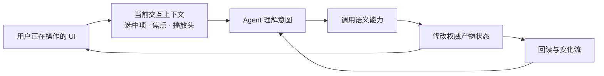
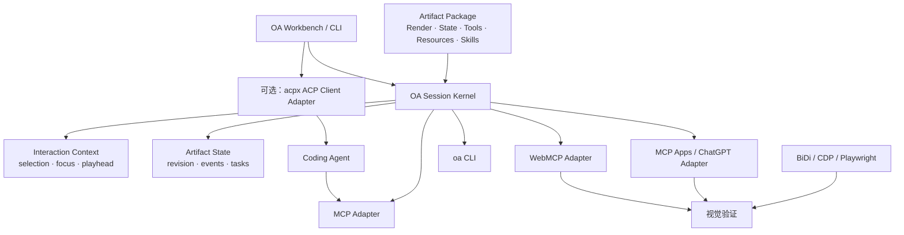

# Agent 怎样看懂并操作一个网页产物：Open Artifacts API 规范调研

> 调研日期：2026-07-20
>
> 研究问题：到目前为止，我们实际看过哪些 API 或协议？它们分别解决什么问题？哪些部分适合 Open Artifacts，哪些问题仍然需要 OA Runtime 自己承担？
>
> 资料口径：只采用官方规范、官方文档、官方仓库，以及本机已安装的 ChatCut 官方插件和运行时 MCP manifest。产品介绍只用于确认公开能力，不把普通产品或实现库当成开放协议。

Open Artifacts 想解决一个很具体的问题。

用户正在视频编辑器里工作。他选中了一个片段，然后对 Agent 说：“把这个缩短一点。”Agent 不应该猜“这个”指什么，也不应该去点击一串脆弱的 DOM 按钮。它应该先知道用户选中了 `clip-42`，再调用稳定的领域动作，例如 `timeline.trim`。

这件事看起来像一个 API，实际包含五条链路：



社区已经为这条链路的不同部分提供了很多协议，但没有一个协议单独完成全部工作。本文整理我们已经实际调研过的规范，并给出它们在 OA 中最合适的位置。

## 1. 先看结论

截至 2026-07-20，我们看过的规范与 API 可以分成七组。

| 层次                 | 已调研规范或 API                                                          | 主要解决的问题                                        | 在 OA 中的建议位置                            |
| -------------------- | ------------------------------------------------------------------------- | ----------------------------------------------------- | --------------------------------------------- |
| Agent 调用能力       | MCP 2025-11-25、WebMCP                                                    | Agent 怎样发现和调用 Tool、读取 Resource              | OA Runtime 的外部 Adapter                     |
| UI 进入 Agent Host   | MCP Apps 2026-01-26、OpenAI Apps SDK / ChatGPT UI Bridge                  | Tool 怎样带一个交互式网页，网页怎样与 Host 通信       | Artifact 分发与 Host 兼容层                   |
| Agent 与前端同步     | AG-UI、Agent Host Protocol                                                | Agent Run、消息、工具调用和共享状态怎样流式同步       | Workbench 会话与事件流参考                    |
| Agent 生成 UI        | A2UI v0.9.1 / v1.0 Candidate                                              | Agent 怎样用声明式 JSON 生成受限、可信组件 UI         | 可选 Renderer，不是核心 Package 格式          |
| 应用连接 Agent       | Agent Application Protocol、Agent Control Protocol、Agent Client Protocol | 应用、Coding Agent 与 UI 能力怎样解耦                 | Agent 连接 Adapter 与设计参考                 |
| ACP 实现案例         | acpx                                                                      | 怎样把 ACP 做成可组合的 Headless CLI / Client Runtime | Coding Agent Adapter 的可借鉴实现，不是新协议 |
| 选择、增量和视觉观察 | Web Annotation、JSON Patch、WebDriver BiDi、CDP、Playwright MCP           | 怎样引用局部内容、表达变化、检查最终页面              | Interaction Context、Change Feed 与视觉验证   |

另外，我们还检查了 **ChatCut MCP**。它不是开放协议，而是一套真实运行的视频编辑服务 API。它的价值是验证：一个 Agent 真正编辑复杂产物时，需要“裁剪过的读取面 + 语义命令 + 视觉验证”，而不是整棵 React State。

用一句话概括最终分工：

> **Artifact Package 声明协议中立的状态、资源、工具和交互上下文；OA Runtime 管理 Session、revision、actor、任务与审计；MCP、WebMCP、MCP Apps、CLI 和浏览器自动化只是不同方向的适配器。**

## 2. MCP：通用的 Agent 能力调用协议

### 它是什么

MCP（Model Context Protocol）是一套基于 JSON-RPC 2.0 的客户端—服务端协议。它把 Server 能提供的能力分成三类：

- `Tools`：模型主动调用的函数；
- `Resources`：应用选择并交给模型的上下文；
- `Prompts`：由用户选择的提示模板。

当前官方发布规范版本是 `2025-11-25`。连接开始时必须先调用 `initialize`，交换协议版本和双方能力，再进入正常调用阶段。

### 最小 API 形状

```json
{
  "jsonrpc": "2.0",
  "id": 1,
  "method": "tools/call",
  "params": {
    "name": "timeline.trim",
    "arguments": {
      "clipId": "clip-42",
      "endSeconds": 16.2
    }
  }
}
```

一个面向产物的 MCP Server 通常至少会用到：

```text
MCP Server
├── tools/list
├── tools/call
├── resources/list
├── resources/read
├── resources/subscribe                 可选
├── notifications/resources/updated    可选
├── prompts/list / prompts/get          可选
└── tasks/*                             实验性长任务
```

关键点：

- `tools/list` 和 `resources/list` 都支持分页；
- Tool 可以声明 `inputSchema`、`outputSchema`，并返回 `structuredContent`；
- Resource 可以通过 URI 寻址，并可选择支持订阅和更新通知；
- `Tasks` 在 2025-11-25 中仍标记为实验性，用于可轮询、可恢复的长任务。

### 状态与交互模型

MCP 管理的是一条有生命周期和能力协商的连接。它没有规定 React Store，也不知道用户正在浏览哪个 Tab。Server 可以把产物状态暴露为 Resources，把编辑动作暴露为 Tools，但 Artifact revision、当前选中项和人机并发语义需要应用自己定义。

### 适合 OA 的部分

- 作为页面外、Headless Agent 和通用 Coding Agent 的主要 Adapter；
- 用 Resource 表达可读取的 Artifact projection；
- 用 Tool 表达 `timeline.trim`、`caption.update` 等语义动作；
- 用 Resource Subscription / Progress 承载通知；对已经协商支持的 Tool，用实验性 Task 承载可轮询、可恢复的长任务；
- 复用成熟的 JSON Schema、结构化结果和能力协商。

### 还欠缺什么

- 不知道当前 Tab、当前 Workbench 或用户选中了哪个对象；
- 没有 Artifact 自带的 `revision`、`baseRevision`、冲突和 undo 语义；
- `tools/list` 分页不等于模型上下文的渐进加载，Host 仍可能一次性把全部 Tool Schema 放进上下文；
- 连接协议不负责 Artifact Package 的源码分发、运行和 Fork。

### 原始来源

- [MCP 2025-11-25：Lifecycle](https://modelcontextprotocol.io/specification/2025-11-25/basic/lifecycle)
- [MCP 2025-11-25：Server primitives](https://modelcontextprotocol.io/specification/2025-11-25/server/index)
- [MCP 2025-11-25：Tools](https://modelcontextprotocol.io/specification/2025-11-25/server/tools)
- [MCP 2025-11-25：Resources](https://modelcontextprotocol.io/specification/2025-11-25/server/resources)
- [MCP 2025-11-25：Tasks](https://modelcontextprotocol.io/specification/2025-11-25/basic/utilities/tasks)

访问日期：2026-07-20。

## 3. WebMCP：让正在打开的网页注册 Tool

### 它是什么

WebMCP 是一个 Web API 提案。网页可以直接在当前 Document 中注册 JavaScript Tool，浏览器里的 Agent 再发现和调用它。

它最像“网页自己告诉 Agent，我能做什么”。Tool 与当前页面的 DOM、Cookie、登录态和 JavaScript 逻辑在同一个 Tab 中。

截至 2026-07-20，WebMCP 的公开规范状态是 **2026-07-10 Draft Community Group Report**。它不是 W3C Recommendation，也不在 W3C Standards Track。Chrome 已提供实验文档，但 API 仍可能变化。

### 最小 API 形状

```js
const controller = new AbortController();

await document.modelContext.registerTool(
  {
    name: 'timeline.trim',
    description: '缩短当前时间线中的一个视频片段',
    inputSchema: {
      type: 'object',
      properties: {
        clipId: { type: 'string' },
        endSeconds: { type: 'number' },
      },
      required: ['clipId', 'endSeconds'],
    },
    annotations: {
      readOnlyHint: false,
    },
    async execute({ clipId, endSeconds }) {
      return timeline.trim({ clipId, endSeconds });
    },
  },
  { signal: controller.signal },
);

// 不再暴露这个 Tool 时：
controller.abort();
```

关键点：

- `registerTool()` 注册 Tool；
- `AbortSignal` 可以用于注销 Tool；
- `toolchange` 表示可见 Tool 列表发生了变化；
- `exposedTo`、`tools` Permissions Policy 和 Origin 规则控制跨 Frame 可见性。

### 状态与交互模型

WebMCP Tool 绑定当前 Document 生命周期。页面关闭或导航后，Tool 也随之消失。页面可以根据当前状态动态注册 Tool，例如只有选中片段时才注册 `timeline.trim`。

但 `toolchange` 只表示“工具清单变了”，不是“视频时间线数据变了”。WebMCP 当前没有 Resource、revision、change feed 或 Durable Task。

### 适合 OA 的部分

- 让 Browser Agent 操作用户正在看的同一份 Render；
- 复用页面已有的领域 handler，不再让 Agent 猜按钮和 CSS Selector；
- 动态暴露只在当前选中项上成立的能力；
- 利用浏览器 Origin 和 iframe 权限机制隔离 Artifact。

### 还欠缺什么

- 必须有打开的 Tab，不适合页面关闭后的后台调用；
- 规范只给出非规范性的 Page Observation 参考模型；除 Tool Map 外观察什么、何时观察、怎样交给 Agent，仍由浏览器实现决定；
- 只有 Tool，没有标准 Resource、Artifact 变化订阅和长任务恢复；
- 当前规范的返回值和版本兼容不足以直接成为 OA Package ABI；
- 没有 actor、session、revision、approval 和审计。

### 原始来源

- [WebMCP Draft Community Group Report](https://webmachinelearning.github.io/webmcp/)
- [Chrome：WebMCP overview](https://developer.chrome.com/docs/ai/webmcp)
- [Chrome：Imperative API](https://developer.chrome.com/docs/ai/webmcp/imperative-api)
- [Chrome：When to use WebMCP and MCP](https://developer.chrome.com/docs/ai/webmcp/compare-mcp)
- [WebMCP 官方仓库与 Explainer](https://github.com/webmachinelearning/webmcp)

访问日期：2026-07-20。

## 4. MCP Apps：把交互式 HTML 交给 Agent Host

### 它是什么

MCP Apps 是 MCP 的 UI 扩展。MCP Server 可以让一个 Tool 指向 `ui://` HTML Resource；Host 取得这个 Resource 后，在受限 iframe 中渲染。UI 再通过 JSON-RPC 2.0 over `postMessage` 与 Host 通信。

它解决的是：**Tool 怎样带来一个可交互界面。**

这与 WebMCP 的方向相反：

```text
WebMCP    已经打开的网页  -> 向 Browser Agent 暴露 Tool
MCP Apps  MCP Server     -> 向 Agent Host 交付一个网页
```

截至 2026-07-20，官方仓库中的稳定规范版本是 `2026-01-26`。

### 最小 API 形状

Tool 先关联一个 UI Resource：

```json
{
  "name": "open_video_editor",
  "description": "打开视频编辑器",
  "inputSchema": { "type": "object" },
  "_meta": {
    "ui": {
      "resourceUri": "ui://video-editor/main",
      "visibility": ["model", "app"]
    }
  }
}
```

Resource 返回一个完整 HTML 文档：

```json
{
  "uri": "ui://video-editor/main",
  "mimeType": "text/html;profile=mcp-app",
  "text": "<!doctype html><html>...</html>"
}
```

UI 与 Host 之间使用这些消息：

```text
initialize
ui/notifications/tool-input
ui/notifications/tool-result
tools/call
ui/message
ui/update-model-context
```

### 状态与交互模型

MCP Apps 把 Host 当作 iframe 面前的 MCP Server 或代理。Tool 的动态数据通过 input/result notification 进入 UI；UI 可以调用同一 Server 上允许 App 使用的 Tool。

规范还定义了 UI Resource、CSP、Tool visibility、Host sandbox proxy 和主题变量。但它不替 Artifact 保存长期权威业务状态。

### 适合 OA 的部分

- 把 Artifact Package 交付进 ChatGPT、Claude 或其他兼容 Host；
- 复用 `ui://`、sandbox iframe、CSP 与 JSON-RPC Bridge；
- 区分仅模型可见、仅 App 可见、两者都可见的 Tool；
- UI 不可用时，Tool 仍可以退化成普通文本结果。

### 还欠缺什么

- 它不定义 Artifact Package、源码 Fork 和本地 Runtime；
- 不定义任意领域状态的 revision、并发冲突和 event log；
- UI 生命周期受 Host 和消息实例约束，不等于长期 Artifact Session；
- 它解决交付与通信，不解决 OA 的权威状态模型。

### 原始来源

- [MCP Apps 官方仓库](https://github.com/modelcontextprotocol/ext-apps)
- [MCP Apps Stable Specification 2026-01-26](https://github.com/modelcontextprotocol/ext-apps/blob/main/specification/2026-01-26/apps.mdx)

访问日期：2026-07-20。

## 5. OpenAI Apps SDK 与 ChatGPT UI Bridge：ChatGPT 对 MCP Apps 的兼容与扩展

### 它是什么

OpenAI Apps SDK 是 ChatGPT 的应用开发 API。今天的新应用优先使用开放的 MCP Apps Bridge；`window.openai` 继续作为兼容层和 ChatGPT 专有扩展。

它不是另一套独立的通用协议。更准确的说法是：

> MCP Apps 提供可移植的基础协议；OpenAI Apps SDK 说明 ChatGPT 怎样承载它，并额外提供 ChatGPT 专属能力。

### 最小 API 形状

当用户在 Widget 中选中三个对象，UI 可以显式更新模型可见上下文：

```js
await rpcRequest('ui/update-model-context', {
  content: [
    {
      type: 'text',
      text: 'User selected clip-42, time range 12.4s–18.8s.',
    },
  ],
});
```

Widget 也可以发起一条新的用户消息：

```js
window.parent.postMessage(
  {
    jsonrpc: '2.0',
    method: 'ui/message',
    params: {
      role: 'user',
      content: [{ type: 'text', text: '请缩短我刚选中的片段。' }],
    },
  },
  '*',
);
```

ChatGPT 还提供可选的 Widget 状态兼容 API：

```js
const previousState = window.openai?.widgetState;

window.openai?.setWidgetState({
  selectedClipId: 'clip-42',
  expandedPanel: 'inspector',
});
```

### 状态与交互模型

官方文档把状态分成三类：

| 状态                | 权威拥有者            | 生命周期            | 例子                   |
| ------------------- | --------------------- | ------------------- | ---------------------- |
| 业务数据            | MCP Server 或 Backend | 长期                | 文档、任务、视频时间线 |
| UI State            | 当前 Widget           | 当前消息中的 Widget | 选中行、展开面板、排序 |
| Cross-session State | 应用自己的 Backend    | 跨会话              | 偏好、工作区选择       |

`ui/update-model-context` 负责“让模型知道 UI 中发生了什么”，不负责修改业务数据。真正的数据修改仍通过 `tools/call` 回到 Server。

### 适合 OA 的部分

- 直接验证了“用户当前选择”应由 UI 显式发送，而不是让模型猜 DOM；
- `ui/update-model-context` 可以作为 OA Interaction Context 的一个 Host 投影；
- 状态分层适合 OA：权威 Artifact State、共享 Interaction Context、私有 View State；
- `tools/call` 与 UI notification 可以承担 Widget 内的人机协作。

### 还欠缺什么

- `ui/update-model-context` 发送的是内容块，不定义稳定的 `EntityRef`、selection schema 或 revision；
- Widget State 绑定消息中的 Widget，不是跨浏览器、跨 Agent 的共享 Session；
- ChatGPT 专属 `window.openai` 不能成为 OA Package 的必需依赖；
- 它没有规定用户改选后，Agent 正在执行的动作怎样处理 stale context。

### 原始来源

- [OpenAI：Build your ChatGPT UI](https://developers.openai.com/apps-sdk/build/chatgpt-ui)
- [OpenAI：Managing State](https://developers.openai.com/apps-sdk/build/state-management)
- [OpenAI：MCP Apps compatibility in ChatGPT](https://developers.openai.com/apps-sdk/mcp-apps-in-chatgpt)
- [OpenAI Apps SDK Reference](https://developers.openai.com/apps-sdk/reference)

访问日期：2026-07-20。

## 6. AG-UI：Agent Runtime 与前端之间的事件流

### 它是什么

AG-UI（Agent User Interaction Protocol）定义 Agent Backend 与 Agentic Frontend 怎样交换一次 Run 的输入和流式事件。

它关注的不是“任意网页怎样注册 Tool”，而是“前端已经连接一个 Agent Runtime 后，消息、Tool Call、Agent 状态和执行进度怎样同步”。

### 最小 API 形状

前端发起 Run 时，会提交消息、状态、工具和上下文。Backend 随后返回事件流。一个最小事件序列类似：

```jsonl
{"type":"RUN_STARTED","threadId":"thread-1","runId":"run-7"}
{"type":"STATE_SNAPSHOT","snapshot":{"selectedClipId":"clip-42"}}
{"type":"TOOL_CALL_START","toolCallId":"call-9","toolCallName":"timeline.trim"}
{"type":"TOOL_CALL_ARGS","toolCallId":"call-9","delta":"{\"clipId\":\"clip-42\"}"}
{"type":"TOOL_CALL_END","toolCallId":"call-9"}
{"type":"RUN_FINISHED","threadId":"thread-1","runId":"run-7"}
```

状态增量使用 RFC 6902 JSON Patch：

```json
{
  "type": "STATE_DELTA",
  "delta": [{ "op": "replace", "path": "/selectedClipId", "value": "clip-43" }]
}
```

### 状态与交互模型

AG-UI 以 Agent Run 为主要生命周期，采用两种常见模式：

- Start → Content → End：消息和 Tool Call 的流式输出；
- Snapshot → Delta：Agent State 与 Activity 的同步。

它还包括 Human-in-the-loop interrupt、自定义事件、Reasoning 和 Activity 事件。

### 适合 OA 的部分

- OA Workbench 如果内嵌 Agent，可直接借鉴其 Run 和 Tool Call 事件；
- 可在 UI 中展示“Agent 正在读取 / 修改哪个片段”；
- Snapshot + JSON Patch Delta 适合作为状态同步参考；
- interrupt 可以承载执行前的人类确认。

### 还欠缺什么

- 它描述 Agent Run，不负责发现任意打开网页的能力；
- `STATE_SNAPSHOT` 是 Agent 与前端共享的状态，不自动等于权威 Artifact State；
- 没有定义 Artifact Package、EntityRef、revisioned domain command；
- OA 不拥有 Agent Run 时，没有必要把全部 Runtime 建在 AG-UI 上。

### 原始来源

- [AG-UI：Core architecture](https://docs.ag-ui.com/concepts/architecture)
- [AG-UI：Events](https://docs.ag-ui.com/concepts/events)
- [AG-UI：Tools](https://docs.ag-ui.com/concepts/tools)
- [AG-UI 官方仓库](https://github.com/ag-ui-protocol/ag-ui)

访问日期：2026-07-20。

## 7. A2UI：让 Agent 用声明式 JSON 生成 UI

### 它是什么

A2UI 是一种 Agent-driven UI 格式。Agent 不直接输出任意 JavaScript，而是输出声明式 JSON；客户端再用已经信任的 Component Catalog 渲染成 React、Flutter、Lit 等原生界面。

截至 2026-07-20，官方文档把 `v0.9.1` 标为 Current production release，把 `v1.0` 标为 Candidate；`v0.9` 是前一个 Stable 版本。下面的四类核心消息沿用 v0.9 系列，示例使用当前的 `v0.9.1`。

### 最小 API 形状

`v0.9.1` 的 Server → Client 流有四类主要消息：

```jsonl
{"version":"v0.9.1","createSurface":{"surfaceId":"clip-inspector","catalogId":"https://example.com/video-catalog.json"}}
{"version":"v0.9.1","updateComponents":{"surfaceId":"clip-inspector","components":[{"id":"root","component":"Card","child":"clip-title"},{"id":"clip-title","component":"Text","text":{"path":"/clip/name"}}]}}
{"version":"v0.9.1","updateDataModel":{"surfaceId":"clip-inspector","path":"/clip","value":{"id":"clip-42","name":"Studio opening"}}}
{"version":"v0.9.1","deleteSurface":{"surfaceId":"clip-inspector"}}
```

关键点：

- 组件是带稳定 ID 的扁平邻接表；
- 数据绑定使用 JSON Pointer；
- 组件和数据可以分批到达，Renderer 要支持渐进渲染；
- 用户 Action 可以把事件和上下文传回承载 Agent 的 Transport；
- `v0.9.1` 还统一使用 `application/a2ui+json` MIME Type，并放宽 `surfaceId` 约束；
- `v1.0` Candidate 新增 `actionResponse` 和 Action ID，并把 `theme` 重命名为 `surfaceProperties`。

### 状态与交互模型

每个 `surfaceId` 有自己的 Component Tree 和 Data Model。Server 用 `updateComponents` 更新结构，用 `updateDataModel` 更新数据。Catalog 决定 Agent 能使用哪些组件，因此客户端不必执行任意代码。

### 适合 OA 的部分

- 作为低信任、受限表达力的安全 Renderer；
- 借鉴稳定节点 ID、Catalog 协商、JSON Pointer binding 和渐进更新；
- 快速生成表单、结果卡片和轻量面板。

### 还欠缺什么

- 它是一种 UI 消息格式，不是 Artifact 源码 Package；
- 表达能力受 Component Catalog 限制，不能直接复用完整 React 生态；
- 不负责本地运行、npm 依赖、Fork 和版本化源码；
- Data Model 是 Surface 的 UI 数据，不自动成为多人协作的权威领域状态。

### 原始来源

- [A2UI 官方首页：v0.9.1 Current / v1.0 Candidate](https://a2ui.org/)
- [A2UI v0.9.1 Protocol](https://a2ui.org/specification/v0.9.1-a2ui/)
- [A2UI Message Reference](https://a2ui.org/reference/messages/)
- [A2UI Actions](https://a2ui.org/concepts/actions/)
- [A2UI 官方仓库](https://github.com/google/A2UI)

访问日期：2026-07-20。

## 8. Agent Application Protocol：应用拥有 UI 和领域 Tool

### 它是什么

Agent Application Protocol（AAP）连接任意 Application 与远程 Agent。

Application 拥有 UI、用户输入和领域 Tool；Agent Server 拥有模型、Agent Loop、对话历史和通用 Tool。双方通过 HTTP 通信，响应使用 SSE 流式返回。

这与 OA 的产品直觉非常接近：视频编辑器最懂自己的时间线，因此 `timeline.trim` 应由编辑器一侧拥有，而不是由每个 Agent 各自猜测。

### 最小 API 形状

```text
Application -> Agent
POST /runs
├── messages
├── client-side tool schemas
├── requested server-side tools
└── context

Agent -> Application, SSE
├── message events
├── tool_call
└── run completion

Application 执行 client-side tool
└── 再提交 tool result，继续 Agent Run
```

### 状态与交互模型

AAP 以远程 Agent Run 为中心。Agent 需要调用 client-side Tool 时暂停，Application 执行后再把结果提交回来。它采用无长期双向连接的 HTTP + SSE 模型，便于远程和水平扩展。

### 适合 OA 的部分

- 验证“领域能力归 Application / Artifact 所有”；
- 适合未来把 OA Workbench 连接到远程 Agent Service；
- Tool Schema 与 Agent Loop 解耦，应用不需要内置模型实现。

### 还欠缺什么

- 不负责 Artifact Package、源码发布和 Fork；
- 不提供多人共享 Artifact Session、revision 和 change feed；
- 需要 Application 主动发起 Run，不是一个通用的 Artifact 能力发现协议；
- 公开采用和规范稳定性仍较早。

### 原始来源

- [Agent Application Protocol：Overview](https://agentapplicationprotocol.com/overview)
- [Agent Application Protocol 官方仓库](https://github.com/agentapplicationprotocol/agent-application-protocol)

访问日期：2026-07-20。

## 9. Agent Control Protocol：应用把 Screen、Field 和 Action 交给 Agent

### 它是什么

这里的 ACP 指 Primoia 发起的 **Agent Control Protocol**，不是后文 Zed 发起的 Agent Client Protocol。

应用向 Agent Engine 发送一个 UI Manifest。Manifest 描述 screens、fields、actions 和 modals；Agent 返回 `set_field`、`click`、`navigate`、`ask_confirm` 等命令，应用执行并按相同的 `seq` 返回结果。

### 最小 API 形状

应用通过 WebSocket 发送带消息信封的 Manifest：

```json
{
  "type": "manifest",
  "app": "OA Video Editor",
  "currentScreen": "video-editor",
  "screens": {
    "video-editor": {
      "id": "video-editor",
      "label": "Video editor",
      "fields": [{ "id": "clip-name", "type": "text", "label": "Clip name" }],
      "actions": [{ "id": "trim", "label": "Trim selected clip" }]
    }
  }
}
```

Agent Engine 再返回 `command` 消息：

```json
{
  "type": "command",
  "seq": 7,
  "actions": [{ "do": "click", "action": "trim" }]
}
```

应用执行后，用相同的 `seq` 返回 `result`，把动作和结果对应起来：

```json
{
  "type": "result",
  "seq": 7,
  "results": [{ "index": 0, "success": true }]
}
```

### 状态与交互模型

它把当前 UI 组织为语义 Manifest，比截图和 DOM scraping 更稳定。命令仍然接近通用 UI 动作，状态主要是当前 Screen 与表单字段。

### 适合 OA 的部分

- 验证了 Manifest → Command → Result 的最小闭环；
- 说明应用可以主动声明 UI 能力，不必让 Agent 猜页面；
- `seq` 可作为调用关联和顺序控制参考。

### 还欠缺什么

- `click`、`set_field` 仍然描述 UI 行为，不如 `timeline.trim` 这样的领域命令稳定；
- Screen / Field 很难表达时间线、图层、画布和异步媒体任务；
- 没有 revisioned document model；
- 当前仍是早期 Draft，OA 不应绑定其 UI Action vocabulary。

### 原始来源

- [Agent Control Protocol 官方网站](https://acp-protocol.org/)
- [Agent Control Protocol Draft Specification](https://github.com/agent-control-protocol/acp/blob/main/spec/SPEC.md)

访问日期：2026-07-20。

## 10. Agent Host Protocol：多个客户端共享一个 Agent Session

### 它是什么

Agent Host Protocol（AHP）是 Microsoft 发布的 Agent Session 同步协议。一个独立 Host 保存权威 Session State，多个 Web、IDE、CLI 或移动客户端可以同时订阅并操作同一个 Session。

截至 2026-07-20，官方仍明确标注 **UNDER ACTIVE DEVELOPMENT**，Wire Types 和 State Shapes 可能发生破坏性变化。

### 最小 API 形状

```text
subscribe(channel URI)
    -> Snapshot
    -> ordered ActionEnvelope stream

reconnect(lastSeenServerSeq, subscriptions)
    -> missed actions
    或
    -> fresh snapshots
```

每条消息都带 `channel: URI`。Server 为 Action 分配单调递增的 `serverSeq`，并广播给所有订阅客户端。Client 可以先乐观执行，再用 Server Echo 中的 `origin` 对账。

### 状态与交互模型

AHP 使用：

- URI Channel；
- 每个 Channel 的不可变状态树；
- Snapshot + 有序 Action；
- Write-ahead optimistic update；
- reconnect replay 或 fresh snapshot。

它是目前最接近“人和 Agent 同时看同一个长期 Session”的邻近协议。

### 适合 OA 的部分

- 借鉴 Channel、Snapshot、ActionEnvelope 与 sequence；
- 支撑 Workbench、CLI 和多个 Agent 同时观察 Artifact Session；
- 借鉴 reconnect、replay 和 optimistic reconciliation；
- 大内容按引用获取，适合视频帧和长 Tool Result。

### 还欠缺什么

- 它的领域是 Agent Chat、Terminal 和代码 Changeset，不是任意 Artifact；
- 没有定义视频 Clip、Annotation 或 Artifact EntityRef；
- 仍在快速演进，不适合直接成为 OA 的唯一 Runtime ABI；
- 解决 Session 同步，不解决 Artifact Package 分发。

### 原始来源

- [Microsoft：What is the Agent Host Protocol](https://microsoft.github.io/agent-host-protocol/guide/what-is-ahp)
- [Agent Host Protocol 官方规范与参考](https://microsoft.github.io/agent-host-protocol/)

访问日期：2026-07-20。

## 11. Agent Client Protocol：IDE 怎样连接 Coding Agent

### 它是什么

这里的 ACP 指 Zed 发起的 **Agent Client Protocol**。它标准化 IDE / Client 与本地 Coding Agent 进程的通信。

Client 启动 Agent 子进程，双方通过 stdin/stdout 上的 JSON-RPC 长连接通信。一条连接可以承载多个并发 Session；Agent 还能反向请求 Tool Permission、文件和 Terminal 能力。

截至 2026-07-20，官方当前稳定的 ACP wire protocol 版本是 `1`。SDK 或 JSON Schema 包的版本号并不等于 wire protocol 版本；双方应以 `initialize` 协商的 `protocolVersion` 和 capabilities 判断兼容性。

### 最小 API 形状

```text
IDE / OA Workbench
    -> 启动 Agent subprocess
    -> initialize
    -> session/new
    -> session/prompt

Agent
    -> streaming session updates
    -> request_permission
    -> filesystem / terminal requests
```

### 状态与交互模型

ACP 以 Coding Agent Session 为核心，重度使用 JSON-RPC Notification 流式更新 UI，也利用双向 Request 让 Agent 请求 Client 权限。

### 适合 OA 的部分

- 如果 OA Workbench 要直接启动 Codex、Claude 或其他 Coding Agent，可采用 ACP Adapter；
- 复用 Agent Session、Permission 和本地进程管理；
- 避免为每个 Coding Agent 单独设计连接协议。

### 还欠缺什么

- 它不描述 Artifact 的状态、Entity 和领域 Tool；
- 解决 `Workbench ↔ Coding Agent`，不是 `Agent ↔ Artifact`；
- 不能替代 OA Capability Contract 或 MCP Adapter。

### 原始来源

- [Agent Client Protocol：Architecture](https://agentclientprotocol.com/get-started/architecture)
- [Agent Client Protocol 官方 Registry](https://github.com/agentclientprotocol/registry)
- [Agent Client Protocol 官方仓库](https://github.com/agentclientprotocol/agent-client-protocol)

访问日期：2026-07-20。

## 12. acpx：把 Agent Client Protocol 变成 Headless CLI / Client Runtime

### 它是什么

`acpx` 不是一个新协议，也不是 OA 应再实现的一层 Artifact API。它是 OpenClaw 开源的 **Agent Client Protocol（ACP）Headless CLI client**：由另一个 Agent、orchestrator 或命令行 harness 启动，用结构化 ACP 通信代替从 PTY 抓取 ANSI 文本。

它因此正好落在 ACP 的 Client 一侧：ACP 规定 Client 怎样连接 Coding Agent；`acpx` 把这件事实现为可复用的 CLI 和 runtime backend。其官方 Vision 明确把目标限定为“最小而有用的 ACP client”，而不是大而全的 orchestration framework。

```text
OA Workbench / 调度器 / CI
          │  启动、传 prompt、读取 JSON 事件
          ▼
       acpx（ACP Client + session/queue/permission runtime）
          │  JSON-RPC / stdio，或由 adapter 启动的 ACP Agent
          ▼
Codex / Claude / Pi / OpenClaw ACP bridge / 其他 ACP Agent
```

### 最小 CLI / API 形状

最小的一次性调用可以是：

```sh
acpx codex exec "检查这个仓库的待办并总结"
```

需要保留上下文时，先创建或确保一个按工作目录和 Agent 命令作用域隔离的 Session，再把 prompt 送入它：

```sh
acpx codex sessions ensure --name artifact-review
acpx codex -s artifact-review "检查 timeline.trim 的输入校验"
acpx codex cancel -s artifact-review
```

它的 CLI 还提供 `sessions list|show|history|close`、`set-mode`、`set`、`status` 和 `config show|init`；`exec` 是不复用已保存 Session 的 one-shot。对自定义 ACP server，可用 `--agent <command>`；内建或 adapter 启动的 Agent 覆盖 Pi、OpenClaw ACP bridge、Codex、Claude 等实现。

`--mcp-config <path>` 还可以读取外部 JSON 中的 `mcpServers` 数组，把 MCP Server 配置交给本次 Agent Session。这为 OA 留出了一条直接集成路径：OA Runtime 暴露 Artifact MCP，Workbench 再通过 `acpx` 把这份配置交给支持 `mcpServers` 的 Coding Agent。已存在的持久 Session 如果要切换 MCP 配置，需要先关闭再重新建立。这个能力取决于目标 ACP Agent：例如 OpenClaw ACP bridge 不接受逐 Session 的 `mcpServers`，其 MCP 必须在 Gateway / Agent 侧配置，不能把 `--mcp-config` 当成对所有 Adapter 都成立的通道。

机器消费时用 `--format json` 获得逐行的原始 ACP JSON-RPC 消息，而不是解析终端画面；`--json-strict` 会进一步抑制非 JSON 的 stderr。也就是说，自动化应直接按 ACP method / payload 消费，不应依赖一个 `acpx` 专属 wrapper。例如一次 prompt 与其流式更新可能是：

```jsonl
{
  "jsonrpc": "2.0",
  "id": "req-1",
  "method": "session/prompt",
  "params": { "sessionId": "abc123", "prompt": [{ "type": "text", "text": "检查待办" }] }
}
{
  "jsonrpc": "2.0",
  "method": "session/update",
  "params": {
    "sessionId": "abc123",
    "update": {
      "sessionUpdate": "agent_message_chunk",
      "content": { "type": "text", "text": "正在检查" }
    }
  }
}
```

输出保留 thinking、tool call、文本和 diff 等 typed ACP update；因此上层可以按事件类型显示进度、记录审计，或做自己的编排，而无需从 ANSI 文本反推状态。

### 它实际补齐的运行时层

ACP 已经定义 Client 与 Coding Agent 的连接、并发 Session、双向 request 和流式 update；`acpx` 实现并补齐了命令行自动化所需的操作层：

- **Session 与生命周期**：持久 Session 记录保存在 `~/.acpx/sessions/`，可按 repo / cwd 与可选名称并行；进程死亡后会重启 Agent，优先尝试 `session/resume`、否则 `session/load`，失败再新建；close 是保留历史记录的 soft close。
- **Prompt queue**：同一 Session 正在运行时，后续 prompt 交给 queue owner 顺序执行；`--no-wait` 入队后立刻返回，`--ttl` 控制 owner 的空闲存活，`cancel` 经 queue IPC 发出协作式 `session/cancel`。
- **Permission、文件与终端能力**：它作为 ACP Client 实现 `fs/*` 与 `terminal/*` handler，并以 `--approve-all`、默认的 `--approve-reads`、`--deny-all` 或 `--permission-policy` 决定批准；默认把文件操作 sandbox 在 `cwd`，`--no-terminal` 则在 initialize 时不声明 terminal capability。
- **Adapter 与互操作**：内建 friendly-name registry 映射到 native ACP 命令或 adapter，例如 `codex -> @agentclientprotocol/codex-acp`、`claude -> claude-agent-acp`；`--agent` 保留对任意自定义 ACP server 的出口。它的职责是抹平 harness 差异、保持 ACP wire semantics 与结构化数据，而不是把下游锁死在某个 Agent。

这里要特别区分历史资料和当前事实。仓库中的《ACP Spec Coverage》文件明确标注日期为 **2026-02-19**；其中列出的“Not Yet Supported”是当日 roadmap 快照。此后 ACP 官方已经把 `session/list`、`session/resume` 和 `session/close` 标为 stabilized，且当前 `acpx` README 已记载 `sessions list` 会在可用时调用 agent-side `session/list`、崩溃恢复会尝试 `session/resume`。因此本文不把该 roadmap 的未支持项当成 2026-07-20 的现状；需要逐项能力判断时，应按当前 `acpx` CLI / README 和目标 adapter 实测。

### 与 OA 的关系和边界

`acpx` 是 OA 连接 Coding Agent 时很好的 **实现参考或可选 Adapter backend**：OA Workbench、CLI 或未来的调度器可以把“在本地 repo 中运行一个持久 Coding Agent、处理权限、拿到结构化执行事件”委托给它，而不是自己再实现每一家 CLI 的 PTY parser、Session 存储与 queue。

```text
OA Runtime 暴露 Artifact MCP
        ↓
Workbench 在目标 ACP Agent 支持时生成本次 Session 的 MCP 配置
        ↓
acpx 启动或恢复 Coding Agent
        ↓
Coding Agent 通过 MCP 读取并操作 Artifact
```

但它不能进入 OA Artifact Contract 的权威层：

- 它的 Session 是“Coding Agent 与 repo”的会话，不是 Artifact 的 `revision`、`baseRevision`、Entity、selection 或 change feed；
- 它的 file / terminal permission 解决本机执行授权，不定义 Artifact 领域 Tool 的 proposal、确认、并发冲突或审计语义；
- 它消费 ACP，不能替代 OA 通过 MCP / WebMCP 暴露的 `timeline.trim` 等 Artifact capability；
- OA 若选用它，应把 `acpx` 产生的 request / typed event 记录为一次 Agent 执行的运行证据，再由 OA Runtime 继续负责 Artifact command 的 revision、actor 与验证。

截至 2026-07-20，`acpx` README 仍明确标为 **alpha**，并警告 CLI / runtime interface 可能变化。因此它适合以显式版本锁定的可替换 Adapter 试用，不应成为 Artifact Package ABI 或唯一的生产 Session Runtime。

### 原始来源

- [openclaw/acpx README](https://github.com/openclaw/acpx/blob/main/README.md)
- [acpx 官方网站](https://acpx.sh/)
- [openclaw/acpx Vision](https://github.com/openclaw/acpx/blob/main/VISION.md)
- [openclaw/acpx CLI Reference](https://github.com/openclaw/acpx/blob/main/docs/CLI.md)
- [openclaw/acpx：2026-02-19 ACP Spec Coverage Roadmap（历史快照）](https://github.com/openclaw/acpx/blob/main/docs/2026-02-19-acp-coverage-roadmap.md)
- [Agent Client Protocol：Introduction](https://agentclientprotocol.com/get-started/introduction)
- [Agent Client Protocol：Architecture](https://agentclientprotocol.com/get-started/architecture)
- [Agent Client Protocol：Message ID RFD（含 `session/update` 示例）](https://agentclientprotocol.com/rfds/message-id)
- [Agent Client Protocol：Session List is Stabilized](https://agentclientprotocol.com/announcements/session-list-stabilized)
- [Agent Client Protocol：Updates](https://agentclientprotocol.com/updates)
- [OpenClaw ACP CLI：逐 Session `mcpServers` 限制](https://docs.openclaw.ai/cli/acp)

访问日期：2026-07-20。

## 13. W3C Web Annotation Data Model：怎样指向产物中的一小块

### 它是什么

Web Annotation Data Model 是 W3C Recommendation。它用 `Body + Target + Selector` 表达“谁对哪个资源的哪一部分说了什么”。

它原本不是 Agent 协议，但非常适合回答 OA 的一个基础问题：用户的评论、问题或修改建议，究竟指向视频时间线里的哪一段？

### 最小 API 形状

```json
{
  "@context": "http://www.w3.org/ns/anno.jsonld",
  "id": "artifact://annotations/annotation-7",
  "type": "Annotation",
  "motivation": "editing",
  "body": {
    "type": "TextualBody",
    "value": "这里节奏太慢，请缩短。"
  },
  "target": {
    "source": "artifact://timeline/clips/clip-42",
    "selector": {
      "type": "FragmentSelector",
      "conformsTo": "http://www.w3.org/TR/media-frags/",
      "value": "t=12.4,18.8"
    }
  }
}
```

### 状态与交互模型

Annotation 自身是独立资源。`Target` 可以是完整资源，也可以通过 Selector 指向一段文本、DOM 节点、图片区域或时间媒体片段。`motivation` 可以表示 commenting、editing、highlighting、questioning 等意图。

### 适合 OA 的部分

- 作为持久 Annotation 的数据模型；
- 借鉴 Body、Target、Selector、State 和 Motivation；
- 用稳定 Artifact URI 配合时间范围、文本 Quote 等 Selector；
- 让人的批注成为 Agent 可读取的结构化资源。

### 还欠缺什么

- 它不描述短暂的 selection、focus、hover 和 playhead；
- CSS Selector 对经常重构的 React DOM 不够稳定；
- 不提供 Tool Call、Session、revision 或 change feed；
- OA 仍需定义视频 Clip、Canvas Node 等领域 EntityRef。

### 原始来源

- [W3C Web Annotation Data Model](https://www.w3.org/TR/annotation-model/)
- [W3C Web Annotation Protocol](https://www.w3.org/TR/annotation-protocol/)

访问日期：2026-07-20。

## 14. JSON Patch：怎样表达一份 JSON 状态的增量变化

### 它是什么

JSON Patch 是 IETF RFC 6902 定义的标准格式。它用一组有顺序的操作描述一个 JSON 文档怎样从旧状态变成新状态。

### 最小 API 形状

```json
[
  { "op": "replace", "path": "/selection/primary", "value": "clip-43" },
  { "op": "add", "path": "/selection/items/-", "value": "clip-44" },
  { "op": "test", "path": "/revision", "value": 42 }
]
```

标准操作共有六种：

```text
add · remove · replace · move · copy · test
```

### 状态与交互模型

Patch 按数组顺序应用。`path` 使用 JSON Pointer。`test` 可以在修改前验证某个值，但 RFC 本身不定义跨请求 revision、权限或事件持久化。

### 适合 OA 的部分

- Artifact State 或 Interaction Context 的增量传输；
- AG-UI 风格的 Snapshot + Delta；
- Event Log 中记录机器可读变化；
- 对小型、结构稳定的 JSON projection 降低传输体积。

### 还欠缺什么

- Patch 描述“哪里变了”，不描述“为什么变”；
- `replace /timeline/items/4/end` 不如 `timeline.trim` 这样的领域命令可审计；
- 数组索引在并发编辑下容易漂移；
- 不包含 actor、revision、idempotency 和业务校验。

因此 OA 可以用 JSON Patch 表达观察增量，但写操作仍应优先使用语义 Tool。

### 原始来源

- [RFC 6902：JSON Patch](https://www.rfc-editor.org/rfc/rfc6902.html)
- [RFC 6901：JSON Pointer](https://www.rfc-editor.org/rfc/rfc6901.html)

访问日期：2026-07-20。

## 15. WebDriver BiDi、CDP 与 Playwright MCP：从浏览器外面观察页面

这三项不是同一个协议，但它们在 OA 中承担同一类职责，所以放在一起比较。

### 它们是什么

| 接口                     | 性质                       | 主要能力                                               |
| ------------------------ | -------------------------- | ------------------------------------------------------ |
| WebDriver BiDi           | W3C 双向浏览器自动化协议   | browsing context、script、network、log、input 等模块   |
| Chrome DevTools Protocol | Chromium 调试与观测协议    | DOM、Runtime、Network、Page、Accessibility、截图和性能 |
| Playwright MCP           | Playwright 官方 MCP Server | 把浏览器自动化能力包装为 Agent 可调用的 MCP Tools      |

### 最小 API 形状

WebDriver BiDi 和 CDP 都使用命令与事件。以 CDP 截图为例：

```json
{
  "id": 7,
  "method": "Page.captureScreenshot",
  "params": { "format": "png" }
}
```

Playwright MCP 则由 Agent 通过 MCP Tool 打开页面、读取可访问性快照、点击或截图。

### 状态与交互模型

它们观察的是浏览器表象：DOM、Accessibility Tree、JavaScript Runtime、网络和像素。它们不知道 `clip-42` 在产品领域里代表什么，也不知道拖动之后是否形成 Artifact revision 43。

### 适合 OA 的部分

- 打开 Session URL；
- 截图、读取 Accessibility Tree 和浏览器日志；
- 证明 Tool 执行后最终 Render 正确；
- 为尚未接入 OA Contract 的旧网页提供 fallback。

### 还欠缺什么

- DOM ref、Selector 和坐标都不是稳定的领域身份；
- 浏览器内部状态不等于 Backend 权威状态；
- 很难表达并发、revision、任务和业务权限；
- 自动点击成功不等于产物修改正确，仍需结构回读。

### 原始来源

- [W3C WebDriver BiDi](https://www.w3.org/TR/webdriver-bidi/)
- [Chrome DevTools Protocol](https://chromedevtools.github.io/devtools-protocol/)
- [Playwright MCP 官方文档](https://playwright.dev/mcp/introduction)

访问日期：2026-07-20。

## 16. ChatCut MCP：真实视频编辑服务怎样给 Agent 设计 API

### 它是什么

ChatCut MCP 不是通用开放协议，而是 ChatCut 产品提供的一套 MCP Service API。我们把它纳入调研，是因为它已经在真实视频编辑领域实现了 Agent 读取、修改和验证产物的完整调用面。

本次核验对象是本机已安装的 ChatCut Codex Plugin `0.2.18`：

```text
Plugin repository  https://github.com/ChatCut-Inc/agent-plugin.git
MCP endpoint       https://api.chatcut.io/api/external-mcp/mcp
Capabilities       Read + Write
Active tools       52
```

### 最小 API 形状

ChatCut 没有提供一个巨大的 `get_all_state` 和一个任意 `patch_state`。它把 API 分成几种任务相关的读取与动作：

```text
ChatCut MCP
├── 定位产物
│   ├── list_projects
│   ├── target_project
│   └── get_editor_url
├── 读取领域状态
│   ├── read_project
│   ├── read_script
│   ├── read_captions
│   └── find_transcript
├── 语义编辑
│   ├── edit_item
│   ├── split_item
│   ├── apply_script
│   └── edit_captions
├── 视觉验证
│   ├── view_asset_frames
│   └── view_timeline_frames
├── 人机交互
│   ├── manage_markers
│   └── ask_followup_questions
└── 长任务
    ├── submit_export
    ├── track_export
    └── track_progress
```

例如，Agent 不需要知道 ChatCut 内部数据库怎样存一个 Clip。它先用 `read_project` 找到 item ID，再调用 `edit_item` 或 `split_item`，最后通过 `read_project` 与 `view_timeline_frames` 双重验证。

### 状态与交互模型

ChatCut 的公开调用面体现出三层：

```text
按任务裁剪的读取面
    +
有 Schema 的语义命令
    +
结构回读与最终画面验证
```

它还明确要求修改前读取最新项目状态，因为用户可能已经在浏览器里手动编辑。`apply_script` 对陈旧的 Script State 有局部 stale protection；生成和导出使用可轮询任务。

### 适合 OA 的部分

- 不暴露整棵 React State，而是提供 task-oriented projection；
- 结构、脚本、字幕、源素材和最终合成画面分开读取；
- 修改通过领域命令完成，不允许任意 Store patch；
- 命令成功后还要结构回读和视觉验证；
- Marker 证明批注应锚定稳定领域对象和时间范围。

### 还欠缺什么

以下是对 2026-07-18 至 2026-07-20 可见 manifest 的观察，不代表 ChatCut 内部完全没有这些机制：

- 没有统一公开的 `revision / baseRevision / ETag`；
- 没有通用 Artifact change feed；
- 没有标准 actor / presence；
- preview、validate、confirm 分散在个别 Tool 中，没有统一 proposal 生命周期；
- project、timeline 等状态主要通过 read-only Tools 查询，没有作为可订阅 MCP Resources 暴露。

### 原始来源

- 本机官方插件：`~/.codex/plugins/cache/chatcut-inc/chatcut/0.2.18/.codex-plugin/plugin.json`
- 本机官方插件：`~/.codex/plugins/cache/chatcut-inc/chatcut/0.2.18/.mcp.json`
- 本机官方 Skill：`~/.codex/plugins/cache/chatcut-inc/chatcut/0.2.18/skills/chatcut-plugin-basics/SKILL.md`
- 本机官方 Skill：`~/.codex/plugins/cache/chatcut-inc/chatcut/0.2.18/skills/verification/SKILL.md`
- 当前 Codex 会话加载的 ChatCut active MCP manifest：52 个 Tool descriptions 与 input schemas
- [ChatCut 官方插件仓库](https://github.com/ChatCut-Inc/agent-plugin)

检查日期：插件与 active manifest 在 2026-07-20 复核；此前的调用面实测发生于 2026-07-18。

## 17. 哪些东西看过，但不应冒充协议

调研过程中还看过一些重要实现。它们能帮助 OA 写代码，但不应与开放协议放在同一层。下面也保留了已研究过的产品 API，避免因为没有独立协议章节而从清单中消失。

| 项目                                                                                                                                                                     | 正确分类                     | 能借鉴什么                                  | 为什么不在上面的协议主表中                        |
| ------------------------------------------------------------------------------------------------------------------------------------------------------------------------ | ---------------------------- | ------------------------------------------- | ------------------------------------------------- |
| React State / `useSyncExternalStore`                                                                                                                                     | 前端框架 API                 | React 与外部权威 Store 的连接               | 不定义 Agent、网络和 Session 互操作               |
| Redux                                                                                                                                                                    | 状态管理库                   | Action Log、Reducer、快照                   | 是实现选择，不是跨产品 Wire Protocol              |
| XState Inspector                                                                                                                                                         | 状态机与观察工具             | Actor、Event、Snapshot                      | 不定义通用 Artifact 领域模型                      |
| Immer Patches                                                                                                                                                            | Patch 生成工具               | 从本地 mutation 生成正反 Patch              | 生成格式与 Runtime 语义仍由应用决定               |
| React DevTools / Profiler                                                                                                                                                | 调试实现                     | Render 与性能观察                           | 私有协议不稳定，也不等于业务状态历史              |
| json-render、OpenGenerativeUI                                                                                                                                            | Generative UI 实现与框架     | Catalog、JSON UI、iframe                    | 可以与 A2UI 比较，但不是 OA Runtime 协议          |
| [Adaptive Cards](https://learn.microsoft.com/en-us/adaptive-cards/templating/) / [Template Service](https://learn.microsoft.com/en-us/adaptive-cards/templating/service) | 声明式 Card 规范与 Alpha API | 模板与数据分离、按数据结构查找模板          | 只覆盖 Card 与模板发现，不负责 Agent Session      |
| [Puck AI](https://puckeditor.com/docs/api-reference/ai/cloud-client/generate)                                                                                            | Page Builder 的厂商 API      | 用 `pageData` 生成或更新页面、Selected Item | API 绑定 Puck Data 与服务，不是跨 Renderer 协议   |
| [Tambo](https://docs.tambo.co/reference/react-sdk/types)                                                                                                                 | Generative UI React SDK      | 稳定组件 ID、`isSelected` 和可持续组件      | 绑定 Tambo Runtime，不定义通用 Artifact 状态      |
| [Thesys C1 / OpenUI](https://docs.thesys.dev/guides/what-is-thesys-c1)                                                                                                   | 厂商 API 与开源 Renderer     | OpenAI-compatible 生成 API、紧凑 UI 语言    | 解决 UI 生成，不解决 Package、Session 与批注      |
| [Agentation](https://www.agentation.com/) MCP                                                                                                                            | 私有 Annotation API Surface  | `list / ask / resolve / clear` 与结构化选区 | 只做过功能级核验，没有完整 Manifest / Schema 审计 |
| Browser Use 类产品                                                                                                                                                       | 浏览器 Agent 实现            | 外部页面操作                                | 产品实现不等于页面主动声明能力的标准              |

这一区分很重要。OA 可以使用 Redux、Immer 或 XState 实现 Runtime，但 Artifact Package Contract 不应该要求所有 Package 采用其中某一个库。

## 18. 把这些规范组合成 OA 的通用 API

前面的协议各自解决一段问题。OA 不需要再发明一种新的网络 Transport，但需要定义一份协议中立的 Artifact Contract。



### 推荐的 Package Interface

```ts
export default defineArtifact({
  render: VideoEditor,

  state: defineState({
    schema: videoProjectSchema,
    initial: createInitialProject,
  }),

  resources: defineResources({
    'artifact://timeline': {
      read: ({ session }) => session.timelineProjection(),
    },
  }),

  tools: defineTools({
    'timeline.trim': {
      inputSchema: trimInputSchema,
      outputSchema: trimResultSchema,
      execute: trimClip,
    },
  }),

  interaction: defineInteractionContext({
    selection: {
      entityTypes: ['video.clip', 'caption', 'timeline.marker'],
    },
  }),
});
```

关键点：

- Package 声明语义能力，不直接实现 MCP Server；
- UI 点击和 Agent Tool Call 最终进入同一个 handler；
- Runtime 注入 `sessionId`、`actor`、`baseRevision` 和 `idempotencyKey`；
- Interaction Context 只保存 Agent 值得知道的 selection、focus 和 playhead；
- hover、scroll、drag preview 等私有 UI State 不进入共享上下文。

### 推荐的 Selection 形状

ChatGPT 的 `ui/update-model-context` 已经证明“UI 显式告诉模型当前选择”是成立的。OA 需要在此基础上增加结构化实体引用和版本语义：

```json
{
  "schemaVersion": "oa.interaction-context/v0",
  "contextVersion": 17,
  "artifactRevision": 42,
  "actor": "human:local-user",
  "viewId": "workbench-main",
  "visibility": "agent",
  "selection": {
    "primary": "artifact://timeline/clips/clip-42",
    "items": [
      {
        "uri": "artifact://timeline/clips/clip-42",
        "type": "video.clip",
        "anchor": {
          "kind": "time-range",
          "start": 12.4,
          "end": 18.8,
          "unit": "second"
        }
      }
    ]
  },
  "focus": { "surface": "timeline" }
}
```

Agent 可以用 Selection 理解“这个片段”，但真正执行时应该把动态选择解析成明确实体：

```json
{
  "tool": "timeline.trim",
  "target": "artifact://timeline/clips/clip-42",
  "observedContextVersion": 17,
  "baseRevision": 42,
  "idempotencyKey": "call-01J...",
  "input": { "endSeconds": 16.2 }
}
```

这样 Runtime 才能分别返回：

```text
CONTEXT_STALE      用户已经改选了别的对象
ENTITY_GONE        clip-42 已被删除
REVISION_CONFLICT  Artifact 已经被其他操作修改
```

## 19. 最终判断

这些规范并不是互相替代关系。

- **MCP** 负责页面外的 Tool、Resource 和长任务互操作；
- **WebMCP** 负责当前 Tab 中的语义能力；
- **MCP Apps** 负责把 HTML Artifact 交付给 Agent Host；
- **OpenAI Apps SDK** 证明 Widget 可以用 `ui/update-model-context` 告诉模型当前选择；
- **AG-UI / AHP** 提供 Run Event、Snapshot、Delta、Channel 和断线恢复的参考；
- **A2UI** 提供低信任的声明式 Renderer；
- **AAP / 两种 ACP** 解决 Application、Workbench 与 Agent 的不同连接方向；
- **acpx** 是 ACP 的 Headless client / runtime 实现案例：它可承接 Coding Agent 的 Session、queue、permission、adapter 与结构化事件，但不拥有 Artifact 的领域状态；
- **Web Annotation** 提供持久批注的 Target / Selector；
- **JSON Patch** 可以表达观察增量；
- **WebDriver BiDi / CDP / Playwright MCP** 负责最终视觉验证；
- **ChatCut MCP** 证明复杂 Artifact 应提供领域读取、语义动作和视觉回读，而不是原始 React State。

因此，OA 最需要自己拥有的不是又一套 Transport，而是这四个稳定概念：

```text
Artifact Session
├── Artifact State        权威产物状态，带 revision
├── Interaction Context   选中项、焦点和播放位置
├── Capability Registry   Resources、Tools、Skills
└── Event / Task Log      变化、进度、审计和恢复
```

这四部分一旦稳定，MCP、WebMCP、MCP Apps、ChatGPT、CLI 和未来的协议都可以成为 Adapter。Artifact Package 的核心合同不必随着任何一个外部协议的演进而重写。
