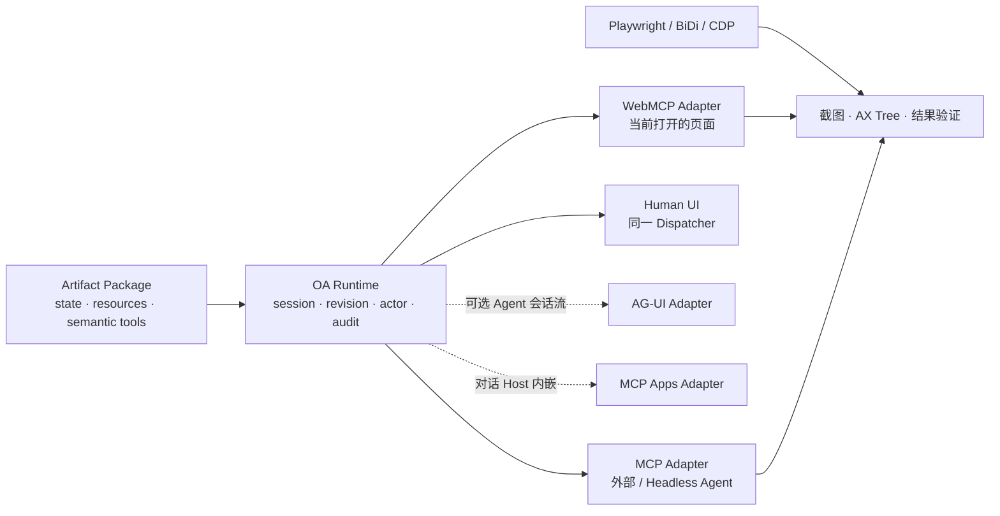
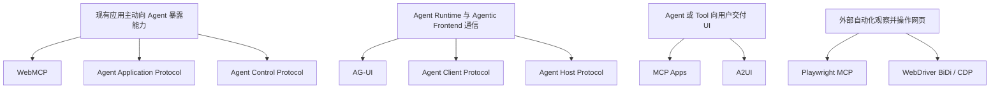

# Agent 与前端产物交互协议版图

> 调研日期：2026-07-19
>
> 研究问题：社区是否已有协议，可以让 Agent 与一个正在运行的前端产物自然地理解、操作和协作？Open Artifacts 应直接采用什么，又必须补充什么？
>
> 资料口径：只采用协议规范、官方文档、官方仓库与官方 SDK。

## 一句话结论

**已经有很多“局部正确”的协议，但没有一个协议完整覆盖 Open Artifacts 所需的 `describe → observe → act → subscribe → see`。**

最合适的组合不是再发明一套新的网络协议，而是：

- Artifact Package 定义协议中立的 Capability Contract；
- WebMCP 负责 Agent 操作当前打开的页面；
- MCP 负责页面外、后台和 Headless Agent；
- AG-UI / AHP 提供状态流、Session 与多客户端同步方面的设计参考；
- MCP Apps 负责把 Artifact 交付进支持 MCP 的对话 Host；
- Playwright MCP / WebDriver BiDi 只做视觉验证与未适配页面的 fallback。



## 先区分四类协议

“Agent 与前端交互”在社区中至少指四件不同的事。如果不先分层，很容易被相似的名字误导。



Open Artifacts 最核心的是第一类，但为了实现完整的人机协作 Session，也需要吸收第二类的状态流；第三类是未来的分发方式；第四类只能承担观察和验证。

## 能力矩阵

图例：✅ 原生覆盖；◐ 可以承载但需要应用适配；— 不负责。

| 协议                            | 已有前端主动声明语义能力                | 权威状态 / 变化流                                         | 外部 Agent 可调用                 | 任意 React 产物      | 主要边界                                           | OA 判断                                 |
| ------------------------------- | --------------------------------------- | --------------------------------------------------------- | --------------------------------- | -------------------- | -------------------------------------------------- | --------------------------------------- |
| **WebMCP**                      | ✅ 页面注册 Tool                        | ◐ 读取可做成 Tool；没有 Artifact change feed              | ◐ 依赖 Browser Agent 实现         | ✅                   | Tool 随 Tab 生命周期消失，Agent 侧传输未标准化     | **当前页面的一等 Adapter**              |
| **MCP**                         | ◐ Runtime 暴露 Tools / Resources        | ✅ Resource read、subscribe、updated notification         | ✅ 生态最广                       | ✅                   | 不理解当前 Tab、DOM 与 Artifact revision           | **后台与通用 Agent Adapter**            |
| **AAP**                         | ✅ 应用提供 client-side tools           | ◐ 应用自行把状态做成 Tool                                 | ✅ 远程 Agent over HTTP/SSE       | ✅                   | 协议围绕 Agent 对话轮次，不是共享 Artifact Session | **概念高度相似，暂作参考**              |
| **Agent Control Protocol**      | ✅ screen / field / action manifest     | ◐ 当前 Screen 与表单字段快照                              | ◐ 连接其 Agent Engine             | ✅                   | Draft、生态很小、动作模型偏表单与通用 click        | **直接竞品信号，不宜采用为底座**        |
| **AG-UI**                       | ✅ Frontend tools 交给 Agent            | ✅ snapshot + RFC 6902 delta + event stream               | ◐ 需要 Frontend 成为 AG-UI Client | ✅                   | 描述 Agent Run，不发现任意网页能力                 | **嵌入 Agent 时可采用**                 |
| **AHP**                         | — 主要描述 Agent Session                | ✅ Channel snapshot、ordered actions、reconnect/reconcile | ◐ AHP Client                      | ✅                   | 领域是 Chat、Terminal、Changeset，不是 Artifact    | **Session / change feed 设计参考**      |
| **Agent Client Protocol**       | ◐ Client 可向 Coding Agent 提供环境能力 | ✅ Agent Session 与流式消息                               | ✅ Coding Agent 生态较成熟        | ✅                   | 面向 IDE ↔ Coding Agent，不描述 Artifact           | **未来 Agent Host 集成 Adapter**        |
| **MCP Apps**                    | ◐ UI 可调用同一 MCP Server Tools        | ◐ Tool input/result notifications；持久状态不完整         | ✅ 取决于 Host 支持               | ✅ sandboxed HTML    | 方向是 MCP Server 把 UI 交付给 Host                | **Artifact 的分发 Adapter**             |
| **A2UI**                        | — Agent 生成声明式 UI                   | ✅ Surface Data Model 与增量更新                          | ◐ 由承载 Agent 协议决定           | — 只能用受信 Catalog | 不是源码发布的自由 React 页面                      | **可选安全 Renderer，不是核心 Package** |
| **Playwright MCP / BiDi / CDP** | — 从 DOM、AX、截图推断                  | — 只有浏览器表象，不是权威业务状态                        | ✅                                | ✅                   | 选择器脆弱、无领域命令与 revision                  | **`see` 与 legacy fallback**            |

## 最相关的协议

### 1. WebMCP：最接近“当前页面就是 Tool Provider”

WebMCP 允许网页用 `document.modelContext.registerTool()` 注册 Tool 的名称、描述、JSON Input Schema 与执行回调。Tool 与当前 Document、登录态、Cookie 和页面 JavaScript 共存，非常符合“人和 Agent 操作同一份 Render”的目标。[WebMCP Draft Community Group Report](https://webmachinelearning.github.io/webmcp/)；[Chrome Imperative API](https://developer.chrome.com/docs/ai/webmcp/imperative-api)

它仍然缺少 Open Artifacts 的关键语义：

- `toolchange` 表示 Tool Registry 变化，不是 Artifact 数据变化；
- 没有标准 Resource、revision、actor、change feed 或冲突模型；
- Tool 随 Tab 关闭或导航消失；
- Browser 如何把 Tool 交给外部 Agent 仍由实现决定；
- 当前仍是 Draft Community Group Report 与 Chrome 实验能力，而非稳定的跨浏览器标准。

因此 WebMCP 应是一等 Adapter，但不能成为 Artifact Package ABI。完整判断见 [`webmcp-interface-fit.md`](./webmcp-interface-fit.md)。

### 2. MCP：现成的 Agent 互操作面，但不是页面协议

MCP 已经提供：

- `tools/list` / `tools/call`；
- `resources/list` / `resources/read`；
- Resource Subscription 与更新通知；
- Input / Output Schema、结构化结果与能力协商。

这些能力很适合由 OA Runtime 暴露给 Codex、Claude、Cursor 等外部 Agent。[MCP Tools](https://modelcontextprotocol.io/specification/2025-11-25/server/tools)；[MCP Resources](https://modelcontextprotocol.io/specification/2025-11-25/server/resources)

但 MCP Server 本身不知道用户正在看哪个 Tab，也不会自动与 React 页面共享状态。OA 必须保证 UI、WebMCP 与 MCP 最终调用同一个 Runtime Dispatcher 和 Artifact Session。

### 3. Agent Application Protocol：与产品理念最相似的小型协议

Agent Application Protocol（AAP）的核心分工是：

> Application 拥有 UI、用户输入和领域 Tools；Agent 作为远程服务拥有模型、Agent Loop 和通用 Tools。

应用在请求中用完整 Schema 提供 client-side tools；Agent 需要调用时返回 `tool_call`，由应用执行后再把结果提交回 Agent。官方甚至直接把视频编辑、CAD、3D 建模和音频工作站列为应用示例。[AAP Overview](https://agentapplicationprotocol.com/overview)

这几乎验证了 Open Artifacts 的一个核心判断：**领域能力应该由 Artifact 所有，而不是要求每个 Agent 单独学习页面。**

但 AAP 解决的是“任意应用连接任意远程 Agent”的对话循环，不负责：

- Artifact Package、源码分发与 Fork；
- 多 Agent / 多客户端共享 Session；
- 当前状态订阅、revision 与并发冲突；
- Agent 在没有应用发起对话时主动发现 Artifact。

其 TypeScript SDK 当前为 `0.8.0`，公开采用仍很早。[AAP Client SDK](https://www.npmjs.com/package/@agentapplicationprotocol/client)

结论：值得跟踪 Tool Registry 与 Remote Agent Connector 的设计，不值得把 OA 的核心绑定到它。

### 4. Agent Control Protocol：题目几乎相同，但模型太偏 UI 自动化

这里指 Primoia 发起的 **Agent Control Protocol**，不是 Zed 发起的同缩写 Agent Client Protocol。

它让应用向 Agent Engine 发送包含 screens、fields、actions、modals 的 Manifest；Agent 返回 `set_field`、`click`、`navigate`、`ask_confirm` 等命令，应用执行并用 sequence ID 返回逐项结果。[ACP 官方说明](https://acp-protocol.org/)；[Draft Specification](https://github.com/agent-control-protocol/acp/blob/main/spec/SPEC.md)

它与 Open Artifacts 都反对截图猜测和 DOM scraping，也都主张应用主动声明语义。但它当前的抽象仍接近“跨平台表单自动化”：

- Field / Screen / Modal 很难表达视频时间线、画布、图层、数据选择和长任务；
- `click`、`set_field` 描述 UI 行为，不如 `timeline.trim`、`clip.move` 这样的领域命令稳定；
- State 主要是当前表单字段状态，不是 revisioned document model；
- Draft 规范与实现生态都很早。

结论：它是非常有价值的市场与方向验证，也证明 Manifest + Command + Result 的最小闭环成立；OA 不应采用它的通用 UI Action 作为 Artifact 命令层。

### 5. AG-UI：最完整的 Agent Runtime ↔ Frontend 事件协议

AG-UI 让前端以 `RunAgentInput` 提供 message、state、tools 和 context，Agent Backend 返回类型化事件流。它原生包含：

- Agent Run / Step 生命周期；
- 文本与 Tool Call 流；
- `STATE_SNAPSHOT`；
- 基于 RFC 6902 的 `STATE_DELTA`；
- Human-in-the-loop、中断与自定义事件。

[AG-UI Architecture](https://docs.ag-ui.com/concepts/architecture)；[AG-UI Events](https://docs.ag-ui.com/concepts/events)

如果 OA Workbench 内部直接承载 Agent 会话，AG-UI 比自造 SSE 消息格式更合适。但它假设前端已经是 AG-UI Client，并不负责发现一个任意打开页面的 Artifact Tools。

结论：**只在 OA 需要拥有 Agent Run 时采用；不要用它替代 Artifact Capability Contract。**

### 6. Agent Host Protocol：最值得借鉴的共享 Session 模型

Microsoft 的 Agent Host Protocol（AHP）把 Agent Session 视为多个客户端可共同订阅的资源：

- 每个 Session、Chat、Terminal、Changeset 都是 URI 标识的 Channel；
- 订阅先获得 Snapshot，再获得有序 Action Envelope；
- Server 是权威状态源；
- Client 可以乐观执行，再用 Server Echo 做 write-ahead reconciliation；
- 断线后可以按 sequence replay，超出窗口时重新取 Snapshot。

[AHP Overview](https://microsoft.github.io/agent-host-protocol/guide/what-is-ahp.html)

这些机制与 OA 的 Artifact Session、human/agent presence、revision、watch 和断线恢复高度相似。但 AHP 当前描述的是 Agent Chat、Terminal 和代码 Changeset，不是任意 Artifact 的领域状态；官方也明确标注仍在 active development。

结论：借鉴 Channel、Snapshot + Ordered Action、Reconnect/Reconcile，不直接依赖其完整 State Schema。

### 7. Agent Client Protocol：连接 Coding Agent 的成熟邻居

Zed 发起的 Agent Client Protocol（ACP）标准化 IDE / Client 与 Coding Agent 之间的 JSON-RPC 会话，包含实时消息、Tool Permission、文件和 Terminal 交互，并已有 Codex、Claude、Gemini、Copilot 等适配器。[ACP Architecture](https://agentclientprotocol.com/get-started/architecture)；[官方 Registry](https://github.com/agentclientprotocol/registry)

它不描述 Artifact 的领域能力，但未来 OA 如果需要直接启动、连接和展示不同 Coding Agent，会比为每个 Agent 写私有 Adapter 更合适。

结论：它属于 `OA Workbench ↔ Agent Process`，不是 `Agent ↔ Artifact Package`。

### 8. MCP Apps：Artifact 进入 Agent Host 的最佳现成通道

MCP Apps 已把 MCP-UI 与 OpenAI Apps SDK 的共性收敛为正式扩展：MCP Server 的 Tool 通过 `_meta.ui.resourceUri` 关联 `ui://` HTML Resource，Host 在 sandboxed iframe 中渲染，并用 JSON-RPC over `postMessage` 实现 UI、Host 与同一 MCP Server 的双向通信。[MCP Apps Stable Specification](https://github.com/modelcontextprotocol/ext-apps/blob/main/specification/2026-01-26/apps.mdx)

这条路线很适合把 Artifact 直接显示在 Claude、ChatGPT 或其他 MCP Host 中，但架构方向与 WebMCP 相反：

```text
WebMCP:   已打开的网站  -> 向 Browser Agent 暴露 Tool
MCP Apps: MCP Server   -> 向 Agent Host 交付一个 UI
```

结论：未来可以由 OA Runtime 把 Artifact Package 包装成 MCP App；不要要求 Artifact Package 本身就是 MCP Server。

### 9. A2UI：安全的 Agent-generated UI，不是源码 Artifact

A2UI 让 Agent 用声明式 JSON 创建和更新 Surface；客户端用受信 Component Catalog 映射为 React、Flutter、Lit 等原生组件。每个 Surface 有 Data Model、JSON Pointer Data Binding 与用户 Action 回传。[A2UI v0.9 Protocol](https://a2ui.org/specification/v0.9-a2ui/)；[A2UI Actions](https://a2ui.org/concepts/actions/)

它非常适合不信任 Agent 代码的 Generative UI，但 Open Artifacts 当前明确要求 Package 源码发布、复用完整 React 生态并方便用户 Fork，因此不应把 A2UI 作为唯一 Package 格式。未来可以把它作为一个受限、安全的 Renderer 类型。

## 浏览器自动化为什么只能是验证层

[WebDriver BiDi](https://www.w3.org/TR/webdriver-bidi/)、[Chrome DevTools Protocol](https://chromedevtools.github.io/devtools-protocol/) 与 [Playwright MCP](https://playwright.dev/mcp/introduction) 可以读取 DOM、Accessibility Tree、截图、日志和网络信息，也可以点击、输入、导航和执行脚本。

它们非常重要，但解决的是：

> Agent 如何从外部观察并操纵一个不配合的页面？

而 OA 的核心问题是：

> Artifact 如何主动、稳定地告诉 Agent 它是什么、当前处于什么状态、允许执行哪些领域动作，以及动作后发生了什么？

浏览器自动化中的 DOM ref、CSS Selector 和坐标都不是稳定的领域身份；它们不知道 `clip-01` 是视频片段，也不知道一次拖动是否产生 revision 12。因此它们应当用于：

1. 打开页面与定位 Artifact；
2. 截图、Accessibility Tree 与最终视觉验证；
3. 用户直接操作的模拟；
4. 未接入 Artifact Contract 的 legacy 页面 fallback。

## 对 Open Artifacts 的推荐决策

### 不创建新的 Transport Protocol

Artifact Package 只发布协议中立的能力定义：

```ts
export default defineArtifact({
  state: defineState({
    schema: stateSchema,
    snapshot: ({ session }) => session.snapshot(),
    subscribe: ({ session, sinceRevision }) => session.changes({ sinceRevision }),
  }),
  tools: defineTools({
    'timeline.trim': {
      inputSchema: trimInputSchema,
      outputSchema: trimResultSchema,
      execute: trimClip,
    },
  }),
});
```

OA Runtime 负责注入：

- `sessionId`、`actor`、授权上下文；
- `baseRevision`、`idempotencyKey`；
- 校验、审批、冲突、审计；
- Snapshot、Change Feed、Task 与恢复。

再由 Adapter 映射到外部协议：

| OA 能力                   | 首选映射                                        |
| ------------------------- | ----------------------------------------------- |
| `describe`                | MCP `tools/list` / WebMCP Tool Map              |
| `observe snapshot`        | MCP Resource / read-only WebMCP Tool            |
| `subscribe changes`       | MCP Resource Subscription / OA Session stream   |
| `act`                     | MCP Tool / WebMCP Tool / UI Dispatcher          |
| `approval`                | Runtime Proposal + Host confirmation UI         |
| `see`                     | Browser screenshot / AX Tree / target highlight |
| 对话 Host 内显示 Artifact | MCP Apps                                        |
| OA 内嵌 Agent 会话        | AG-UI                                           |
| Coding Agent Process 接入 | Agent Client Protocol                           |

### 第一版最小组合

```text
必须实现
├── Package: defineState + defineTools
├── Runtime: list/call + snapshot/watch + revision
├── WebMCP Adapter: 当前页面 Agent
└── MCP Adapter: 页面外 Agent

验证工具
└── Playwright MCP: open + screenshot + visual verification

暂不实现
├── 完整 AG-UI Agent Host
├── MCP Apps 分发
├── A2UI Renderer
├── AAP Connector
└── ACP Client Host
```

## 最终判断

社区已经充分验证了 Open Artifacts 的需求，但答案目前是碎片化的：

- WebMCP 证明“页面主动暴露语义 Tool”成立；
- AAP 与 Agent Control Protocol 证明“应用拥有领域能力，Agent 不应猜 UI”成立；
- AG-UI 与 AHP 证明“Snapshot + Delta/Action Stream + Session”成立；
- MCP 证明跨 Agent 的 Tool / Resource 互操作成立；
- MCP Apps 证明交互式网页可以作为 Agent Host 内的一等结果；
- A2UI 证明安全的声明式 UI 通道成立。

**仍然空缺的产品层，是把这些能力统一到一个源码发布、可本地运行、可 Fork、具有长期 Artifact Session 的 Package Runtime。** 这正是 Open Artifacts 应该占据的位置。
