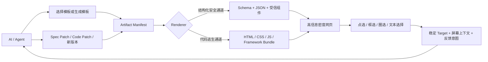

# Open Artifacts：竞品与相邻技术版图

> 调研快照：2026-07-14
> 方法：只采用官方文档、官方产品页面、官方 GitHub 仓库和标准规范。下文的「覆盖」表示公开资料明确展示了该能力，不等于对稳定性、性能或商业可用性的背书。厂商自行公布的性能数字会单独标注。

> **产品结论更新（2026-07-14）：** 本文保留最初的市场证据与当时推导，但其中
> “Artifact Manifest + renderer 引用 + Annotation-first”的建议已经被创始人修正，不再代表现行架构。
> 当前核心是 **源码发布的 Artifact Package**：npm package 本身就是 render，AI 输出它的
> JSON input，用户可以在本地直接 fork 源码。现行边界见
> [`docs/product-brief.md`](../product-brief.md) 与
> [`docs/artifact-package-format.md`](../artifact-package-format.md)。

## 一句话结论

值得做，但 Open Artifacts 不应该把自己定义成「另一个 Generative UI 框架」。

现有项目已经分别解决了大部分零件：

- [MCP Apps](https://modelcontextprotocol.io/extensions/apps/overview) 解决工具如何把交互式 HTML UI 交给 AI Host；
- [A2UI](https://developers.googleblog.com/en/a2ui-v0-9-generative-ui/) 与 [json-render](https://github.com/vercel-labs/json-render) 解决模型如何安全地产生结构化 UI；
- [Claude Artifacts](https://code.claude.com/docs/en/artifacts)、[Gemini Canvas](https://support.google.com/gemini/answer/16047321) 解决 AI 即时生成、预览和修改网页；
- [Puck AI](https://puckeditor.com/docs/ai/overview) 解决既有组件、结构化页面数据和可视编辑的组合；
- [Agentation](https://github.com/benjitaylor/agentation) 与 [tldraw Make Real](https://github.com/tldraw/make-real-starter) 解决「指着画面告诉 Agent 哪里要改」的一部分问题。

公开的一手资料中，没有发现一个项目同时提供以下完整闭环：**开放且可移植的 Artifact 包、标准输入 Schema、可发现和版本化的语义模板、结构化与任意代码双运行时、跨版本稳定的圈选反馈，以及 AI 产出 Patch 后的版本管理**。这才是 Open Artifacts 可以占据的产品层。

## 先定义要打通的链路

Open Artifacts 的对象不应只是一次渲染结果，而应是一个可保存、可迁移、可继续编辑的 Artifact：



其中已有标准可以承接局部协议：MCP Apps 承接 Host 与 UI 的交付和通信，[AG-UI](https://docs.ag-ui.com/concepts/events) 承接 Agent 与前端之间的事件、状态快照和增量，[W3C Web Annotation Data Model](https://www.w3.org/TR/annotation-model/) 承接 Annotation 的 Body、Target 与 Selector；但三者没有定义上图的完整 Artifact 生命周期。

## 核心项目对比

| 项目                                                                                    | 最强覆盖环节                            | 标准 JSON / Schema                   | AI 修改 UI                 | 任意前端依赖                                          | 视觉定位反馈                      | 与 Open Artifacts 的关键差异                                                   |
| --------------------------------------------------------------------------------------- | --------------------------------------- | ------------------------------------ | -------------------------- | ----------------------------------------------------- | --------------------------------- | ------------------------------------------------------------------------------ |
| [MCP Apps](https://apps.extensions.modelcontextprotocol.io/api/documents/Overview.html) | Tool → HTML Resource → Host             | 部分：工具输入与 `structuredContent` | 由应用自行实现             | 强：HTML iframe + CSP 声明                            | 部分：UI 可回传消息和上下文       | 是交付与通信协议，不是模板注册表或 Artifact 包规范                             |
| [A2UI](https://github.com/google/A2UI)                                                  | Agent → 声明式 UI → 原生 Renderer       | 强                                   | 强：流式增量更新           | 弱：只能使用客户端受信 Catalog，iframe 需由 Host 封装 | 无内建终端用户圈选协议            | 是安全 UI 描述协议，不负责可移植网页、代码运行时和 Artifact 生命周期           |
| [json-render](https://github.com/vercel-labs/json-render)                               | Catalog → JSON Spec → 多 Renderer       | 强：Zod Catalog + Spec               | 强：可流式生成 Spec        | 部分：组件由开发者预注册                              | 部分：Devtools 有 DOM Picker      | 最接近结构化渲染内核，但不是 Artifact Host、模板市场或用户反馈协议             |
| [OpenUI](https://github.com/thesysdev/openui)                                           | Component Library → OpenUI Lang → React | 类型化，但刻意不以 JSON 为核心       | 强                         | 部分：自定义 React 组件                               | 无内建圈选协议                    | 是聊天式 Generative UI 框架；没有通用包格式、模板发现和反馈闭环                |
| [Tambo](https://docs.tambo.co/concepts/generative-interfaces/generative-components)     | 已注册 React 组件 → 流式 Props          | 强：Zod Props                        | 强                         | 部分：React 组件注册                                  | 部分：组件级选择                  | 面向嵌入既有 React App，不是可独立分享的网页 Artifact                          |
| [Puck AI](https://puckeditor.com/docs/ai/overview)                                      | Config + Data → 页面 → 可视编辑         | 强：组件 Config 与 Puck Data         | 强：可生成或更新 Page Data | 部分：React 组件                                      | 强：页面编辑器能选择元素          | 最接近模板产品形态，但核心是 React Page Builder，AI 服务仍是 Puck 生态的一部分 |
| [Claude Code Artifacts](https://code.claude.com/docs/en/artifacts)                      | AI → 单页 → 在线预览与持续更新          | 无通用数据合同                       | 强                         | 弱：其严格 CSP 禁止外部脚本、样式和网络请求           | 弱：反馈返回主要靠 Copy as prompt | 验证了即时 Artifact 需求，但格式、Host 和编辑循环封闭且不可移植                |
| [Gemini Canvas](https://support.google.com/gemini/answer/16047321)                      | AI → App/Code → Preview                 | 无通用数据合同                       | 强                         | 由产品环境决定                                        | 强：Select & ask                  | 是闭源产品能力，不提供模板/运行时/Annotation 的开放协议                        |
| [Agentation](https://www.agentation.com/)                                               | DOM/区域 → 结构化 Annotation → Agent    | 输出是结构化上下文                   | 间接：Agent 据反馈改代码   | 不负责运行时                                          | 强                                | 几乎解决反馈通道，但不负责渲染、模板、Artifact 包和版本 Patch                  |

这里最重要的判断是：**A2UI/json-render/OpenUI 已经在争夺「模型输出 UI 的语言和 Renderer」这一层；Open Artifacts 应位于它们之上，并允许多个 Renderer 成为插件。**

## A. AI Artifacts 与即时 HTML 运行时

### MCP Apps

- **覆盖链路：** Tool 返回 UI → Host 加载 UI → UI 调工具、发消息或更新模型上下文。
- **机制：** MCP Tool 通过元数据引用 `ui://` HTML Resource，Host 将它放进沙箱 iframe；模型可见信息放在 `content`，面向 UI 的数据可放在 `structuredContent`，UI 与 Host 通过 JSON-RPC 消息通信。[官方 Overview](https://apps.extensions.modelcontextprotocol.io/api/documents/Overview.html) 还定义了外部资源的 CSP 声明和渐进增强路径。
- **可借鉴：** Open Artifacts 不必再发明一套 Host ↔ iframe 消息总线；Artifact 可以把 MCP Apps 当作一种分发适配器。Google 官方也明确对比了两条路线：MCP Apps 给予 HTML/iframe 自由度，A2UI 则发送声明式 JSON 交给客户端原生渲染。[A2UI 与 MCP Apps 集成说明](https://developers.googleblog.com/en/a2ui-and-mcp-apps/)
- **差异：** MCP Apps 标准化「怎样交付和连接一个 UI」，没有定义如何按数据 Schema 找模板、如何把 Artifact 打包版本化、如何用 Annotation 驱动下一次 Patch。

### Claude Artifacts

- **覆盖链路：** AI 生成文档或单页应用 → 侧边窗口实时预览 → 连续对话修改 → 分享或复用。
- **机制：** Claude 的通用 Artifacts 支持 Markdown、HTML、SVG 和 React，并提供版本、分享与 Remix 等产品能力。[Claude Artifacts 官方说明](https://support.claude.com/en/articles/9487310-what-are-artifacts-and-how-do-i-use-them) Claude Code 的 Artifacts 则可从 HTML/Markdown 生成一个持续更新的在线页面，官方举例包括 annotated diff、dashboard 和 timeline。[Claude Code Artifacts](https://code.claude.com/docs/en/artifacts)
- **边界：** Claude Code Artifact 是自包含单页；其严格 CSP 禁止外部脚本、样式、字体、图片、网络请求、XHR 和 WebSocket，并限制大小为 16 MiB。[安全与限制](https://code.claude.com/docs/en/artifacts#security-and-limitations)
- **差异：** 它证明「不要只回文字，直接给可交互结果」成立，但没有开放的 `template + input schema + data` 合同；依赖策略也与 Open Artifacts 期望的第三方框架/库运行能力相反。Claude Code 把结果带回 Agent 的官方路径仍包含手工 `Copy as prompt`，不是结构化 Annotation → Patch。

### Gemini Canvas

- **覆盖链路：** 生成 App/代码 → Preview → 直接改代码或让模型修改 → 对具体区块提问。
- **机制：** Canvas 提供 Preview、Code、Console 和 Recent changes；其 App 模式的 **Select & ask** 可以点选页面区域并要求 Gemini 修改。[Gemini Apps 帮助中心](https://support.google.com/gemini/answer/16047321)
- **差异：** 交互体验很接近目标，但模板、输入格式、运行时和选择结果都留在 Gemini 产品内部，开发者不能把它当作跨 Host 的 Artifact 协议。

### WebContainers 与 E2B：代码通道的基础设施，而不是产品

- [WebContainers](https://webcontainers.io/guides/introduction) 在浏览器内运行 Node.js，可安装 npm 依赖、启动开发服务器并把预览挂入 iframe；适合本地、低延迟的前端代码 Artifact。
- [E2B](https://e2b.dev/docs) 提供隔离的云端沙箱和可预装 npm 包的自定义 Template；适合需要更完整工具链、网络或后端进程的代码 Artifact。[安装自定义包](https://e2b.dev/docs/quickstart/install-custom-packages)
- 两者只解决执行隔离与依赖安装，不解决标准数据输入、模板发现、信息编排、反馈 Target 和 Artifact 版本。

## B. JSON / Schema 驱动的 Generative UI

### Google A2UI

- **覆盖链路：** Agent 发送 UI 描述 → 客户端校验 → 映射到受信组件 → 流式渲染和更新。
- **机制：** A2UI 是声明式 JSON 格式。Agent 不能直接发送可执行代码，只能引用客户端预先批准的 Component Catalog；扁平组件列表用稳定 ID 建立关系，便于增量传输与渲染。[官方仓库](https://github.com/google/A2UI) v0.9 增加客户端函数、客户端到服务端的数据同步，以及对中断/错序流的恢复能力，并列出 React、Flutter、Lit 和 Angular Renderer。[v0.9 发布说明](https://developers.googleblog.com/en/a2ui-v0-9-generative-ui/)
- **可借鉴：** 稳定节点 ID、Catalog 协商、客户端执行动作和流式修复都适合成为 Open Artifacts 的安全通道。A2UI 也允许客户端 Catalog 映射既有组件，必要时把 iframe 封装成受信组件。[项目介绍](https://developers.googleblog.com/introducing-a2ui-an-open-project-for-agent-driven-interfaces/)
- **差异：** A2UI 是 UI 消息与 Renderer 规范，不是可下载/分享的 Artifact 包；它不管理语义模板、依赖锁、生成来源、可编辑策略，也没有用户圈选后的 Target/Patch 协议。

### Vercel json-render

- **覆盖链路：** 开发者定义 Catalog → 模型输出 JSON Spec → React/Vue/Svelte 等 Renderer 渲染 → Action 与 State 交互。
- **机制：** Catalog 用 Zod 定义允许的组件、Props 和 Action；模型输出 `root + elements` Spec，官方强调安全、可预测和渐进式流传输。仓库列出 React、Vue、Svelte、Solid、React Native、Next.js、PDF、Email、Video 和 3D 等目标，并包含 State、Action、Data Binding 与 MCP 包。[官方仓库](https://github.com/vercel-labs/json-render)
- **模板信号：** 官方 Examples 同时展示 AI Dashboard 和完全不调用 AI 的静态 JSON；Dashboard 示例包含图表、数据绑定和拖放布局，说明同一 Renderer 能服务「模型即时生成」与「预制模板 + 标准数据」两种模式。[Examples](https://json-render.dev/examples)
- **反馈信号：** Devtools 已有 Spec Tree、State Editor、Action/Stream Log、Catalog Browser 和 DOM Picker，但这些是开发调试能力，不是面向最终用户的 Annotation → Agent Patch 合同。[Devtools 说明](https://github.com/vercel-labs/json-render#devtools)
- **差异：** 它是最适合直接采用或兼容的结构化渲染内核，但 Open Artifacts 仍需补上包格式、模板注册/发现、Host、分享、版本和反馈闭环。

### Thesys OpenUI / C1：JSON 不应成为教条

- **覆盖链路：** 组件库与类型合同 → 模型生成紧凑 UI 语言 → 流式解析 → React 渲染。
- **机制：** OpenUI 用 Zod 定义组件合同，并从组件库生成模型提示；模型输出 streaming-first 的 OpenUI Lang，再由 React Renderer 和 Chat UI 渲染。[官方仓库](https://github.com/thesysdev/openui) [C1](https://docs.thesys.dev/guides/what-is-thesys-c1) 是其托管的 OpenAI-compatible Generative UI API/React SDK。
- **反例价值：** Thesys 官方解释其早期采用 JSON，后来因 token 冗余和不完整流的解析问题改为紧凑语言；其公布的「最多减少 67% token」等数字属于厂商基准，不应当作独立结论，但足以提醒 Open Artifacts：标准输入可以是 JSON，模型内部生成格式未必必须是 JSON。[OpenUI 设计说明](https://www.thesys.dev/blogs/openui)
- **差异：** OpenUI 解决生成语言和 React Renderer，不解决可移植 Artifact、模板注册表和可定位反馈。Open Artifacts 应允许 JSON、A2UI、OpenUI Lang 等成为不同编码，而不是押注唯一 DSL。

### Tambo

- **覆盖链路：** 注册 React 组件及 Zod Props → 模型选择组件 → 流式生成 Props → 后续消息继续操作组件。
- **机制：** Generative Component 每条消息生成一次；Interactable Component 以 ID 持续存在，AI 能读取并更新 Props/State。[Generative Components](https://docs.tambo.co/concepts/generative-interfaces/generative-components) [Interactable Components](https://docs.tambo.co/concepts/generative-interfaces/interactable-components) React SDK 还暴露 `isSelected`，可把某个组件标为下一轮 AI 交互对象。[SDK Types](https://docs.tambo.co/reference/react-sdk/types)
- **差异：** 它证明稳定组件身份和选择状态能进入模型上下文，但粒度仍是「组件」，不是自由框选、圈选、文本区间或跨版本 Target；产物也嵌在 React App 中，不是独立 Artifact。

## C. 模板、报告与 Dashboard 渲染

### Puck 与 Puck AI

- **覆盖链路：** 开发者提供组件 Config → 页面 Data 选择组件与 Props → `<Render>` 输出页面 → Visual Editor 编辑 → AI 生成或更新 Data。
- **机制：** Puck 的 `Config` 定义组件、字段和 Render 函数，编辑器产出的 `Data` 可以再次交给 Renderer。[Component Configuration](https://puckeditor.com/docs/integrating-puck/component-configuration) Puck AI Beta 使用现有组件生成可预测页面，既有聊天插件，也有 Headless `generate` API；后者可接收现有 `pageData` 并返回更新后的 Puck Data。[AI Overview](https://puckeditor.com/docs/ai/overview) [Headless Generate](https://puckeditor.com/docs/api-reference/ai/cloud-client/generate)
- **反馈信号：** Puck 编辑器有选中元素、Overlay、拖放和插件机制，API 暴露 Selected Item，因而已经具备把「选中对象」交给 AI 的大部分 UI 前提。[Plugins](https://puckeditor.com/docs/extending-puck/plugins)
- **差异：** 这是最接近 Open Artifacts「模板 + 数据 + AI 修改 + 可视选择」的既有形态，但定位是 React Page Builder/CMS；它不定义通用 AI 答案 Artifact、跨 Renderer 包格式或自由区域 Annotation，AI Beta 也属于 Puck 的服务层。

### Adaptive Cards Templating

- **覆盖链路：** JSON 模板 + JSON 数据 → Host 原生 UI。
- **机制：** Adaptive Cards 是平台无关的 JSON UI 片段，由不同 Host 转换成原生外观；Templating 把 Layout 与 Data 分离，在运行时扩展为 Card Payload。[Adaptive Cards 概览](https://learn.microsoft.com/en-us/adaptive-cards/) [Templating](https://learn.microsoft.com/en-us/adaptive-cards/templating/)
- **模板发现信号：** 官方 Template Service PoC 可以保存/共享模板，`/find` 还会分析输入数据结构，返回匹配模板与置信度；文档同时明确它仍是 Alpha/概念验证。[Template Service](https://learn.microsoft.com/en-us/adaptive-cards/templating/service)
- **差异：** 它是「标准数据 → 自动找模板」最直接的历史先例，但 Schema 受 Card 场景限制，也没有 AI 生成/修改模板、完整网页依赖或视觉反馈闭环。

### Vega-Lite

- **覆盖链路：** 数据 + 声明式 JSON Grammar → 可交互图形。
- **机制：** Vega-Lite 用简洁 JSON 描述数据、Transform、Encoding、Selection、Layer 和 Multi-view，并编译为 Vega。[官方文档](https://vega.github.io/vega-lite/)
- **差异：** 它很适合作为 Open Artifacts 的图表子 Renderer，且能避免模型重复生成脆弱的图表代码；但它只处理可视化，不处理整页叙事、组件动作、Artifact 包和 Annotation。

### Observable Framework 与 Evidence

- [Observable Framework](https://observablehq.com/framework/project-structure) 用 Markdown、HTML、JavaScript 与 SQL 组织 Data App，支持 npm、本地和远程模块导入，并通过 Data Loader 生成可部署的静态数据快照。[Imports](https://observablehq.com/framework/imports) [Data Loaders](https://observablehq.com/framework/data-loaders)
- [Evidence](https://docs.evidence.dev/) 用 SQL、Markdown 和组件构建数据产品，官方开源仓库强调可组合的 Chart、Table、Templated Page、Loop 和 Conditional。[官方仓库](https://github.com/evidence-dev/evidence)
- 两者证明高信息密度页面往往来自「内容叙事 + 数据查询 + 专用图表组件」，不只是把聊天文字换成卡片；但它们是项目/构建工具，不是低延迟的 AI JSON Artifact Renderer，也没有圈选反馈协议。

## D. 视觉标注到 AI 的反馈闭环

### Agentation

- **覆盖链路：** 点击元素、选择文本、拖选多个元素或框选任意区域 → 记录反馈 → 生成结构化上下文 → Agent 获取并处理 Annotation。
- **机制：** 官方仓库列出 Element Selector、Text Selection、Multi-select、Area Selection 和 Animation Pause；输出包含 Selector、位置和上下文。[GitHub](https://github.com/benjitaylor/agentation) 产品页面还展示 CSS Selector、源文件路径、React Component Tree、Computed Styles、Intent 和 Priority，并通过 MCP 让 Agent `list / ask / resolve / clear` Annotation。[Agentation](https://www.agentation.com/)
- **差异：** 这是与目标「标注、框圈后自然反馈」最接近的组件，但服务对象是开发中的 React 代码库；它不负责渲染 Artifact，也没有跨 Renderer、跨版本的通用 Target 或 Spec Patch。其许可为 PolyForm Shield，若要复用代码而非兼容输出格式，还需单独评估商业分发边界。[License](https://github.com/benjitaylor/agentation/blob/main/LICENSE)

### tldraw Make Real 与 Agent Template

- **覆盖链路：** 用户画草图/选择区域 → 截图和 Shape 上下文发给模型 → 模型生成 HTML → iframe 预览 → 在画布继续标注并迭代。
- **机制：** Make Real Starter 把选中 Shape 截图交给 GPT，再把返回 HTML 放进 iframe；用户可以在 iframe 周围继续画注释后再次生成。[Make Real Starter](https://github.com/tldraw/make-real-starter) 更通用的 Agent Template 同时提供用户消息、选中 Shape、可见屏幕、区域边界、最近动作、截图和简化后的结构化 Shape。[Agent Template](https://github.com/tldraw/agent-template)
- **可借鉴：** 反馈不应只发送一个 CSS Selector。结构化对象、像素截图、Viewport/Bounds 和最近交互共同构成更稳健的多模态上下文。
- **差异：** tldraw 是 Canvas-first 的生成式画布，目标是让 Agent 操作 Shape 或把草图变成原型；它没有面向 DOM/Schema Template 的 Artifact Package。

### v0 Design Mode

- **覆盖链路：** 视觉选择元素 → 在输入框出现目标对象 → 用户发定向 Prompt → AI 修改源代码。
- **机制：** Vercel 的官方社区指南展示 Design Mode 中选择元素、调整属性，以及将目标元素作为 Badge 附到消息后进行 AI 修改；还能从对象跳转到对应代码。[Design Mode 指南](https://community.vercel.com/t/edit-ui-with-v0s-design-mode/17477) v0 也允许通过 Custom Registry 把自有 Design System、Components 与 Blocks 提供给模型。[Design Systems](https://v0.dev/docs/design-systems)
- **差异：** 它验证「选中对象 + 自然语言」比描述 DOM 位置更自然，但反馈和代码变更都绑定 v0 工程环境，未形成独立 Annotation/Patch 标准。

### W3C Web Annotation Data Model

- **覆盖链路：** 不是 AI 产品，而是可作为反馈对象的数据模型。
- **机制：** 标准用 JSON-LD 表示 Annotation 的 Body 与 Target，并定义 Fragment、CSS、XPath、Text Quote、Text Position、SVG、Range 等 Selector，以及用于资源变化的 State 与 Refinement。[W3C Recommendation](https://www.w3.org/TR/annotation-model/)
- **差异与用途：** 标准不会捕获 React 组件、Schema Node、截图或生成来源，也不会产生代码 Patch；Open Artifacts 可以扩展它，而不必从零定义 `annotation.body` 与 `annotation.target`。

## 已经存在的零件，和真正缺失的集成层

### 已经存在

1. **Host 与 UI 交付：** MCP Apps 已有 `Tool + HTML Resource + sandboxed iframe + JSON-RPC` 模型；OpenAI 的官方 [Apps SDK Examples](https://github.com/openai/openai-apps-sdk-examples) 还展示了基于工具 Schema、结构化 Payload 和 Widget Resource 的 List、Map、Carousel 与 3D UI。
2. **安全结构化渲染：** A2UI、json-render、Tambo 已证明「开发者控制组件 Catalog，模型只生成受约束结构」可行。
3. **任意代码执行：** Claude/Gemini/v0 验证产品体验，WebContainers/E2B 提供可选的隔离执行底座。
4. **模板与数据分离：** Puck、Adaptive Cards、Vega-Lite、Observable 和 Evidence 已经覆盖页面、卡片、图表和数据报告的不同粒度。
5. **视觉反馈：** Agentation、tldraw、Gemini Canvas 和 v0 已经证明元素选择、区域选择、截图与结构化上下文能显著缩短反馈指代。
6. **增量状态协议：** AG-UI 定义状态 Snapshot/Delta，`STATE_DELTA` 使用 RFC 6902 JSON Patch，适合作为实时更新的传输参考。[AG-UI Events](https://docs.ag-ui.com/concepts/events)

### 仍然缺失

1. **可移植 Artifact 包。** 现有方案通常只传 HTML、只传 UI 消息、只传 Page Data，或把全部状态留在某个产品中。缺少一个同时声明 Renderer、Input Schema、Data、依赖、Capability/CSP、Action、来源、许可、版本和编辑策略的开放 Manifest。
2. **同一生命周期下的双通道。** 安全的 Catalog/JSON 通道与自由的 HTML/Framework 通道通常属于两套产品。Open Artifacts 可以让两者共享保存、分享、标注、版本和 Patch 语义，同时保持不同安全级别。
3. **按「沟通任务」组织的模板发现。** Page Builder 以页面区块组织，BI 工具以图表组织；AI 回答需要 Comparison、Timeline、Decision Matrix、Evidence Map、Causal Graph、Plan、Architecture、Research Brief 等语义模板，并根据输入 Schema 与用户意图选择，而不只是根据视觉组件拼页面。
4. **跨版本稳定的 Annotation Target。** CSS Selector 会因 DOM 重排失效，像素框会因 Viewport 变化失效，文本引用会因改写失效。需要把 Schema Node ID、DOM Selector、Source Map、Text Quote、几何区域、Viewport 和截图组合起来，并在版本变更时迁移 Target。
5. **反馈到变更的标准结果。** 现有选择工具通常只把上下文塞回 Prompt。缺少统一的 `Annotation → intent → Spec Patch / Code Patch → validation → new artifact version` 协议。
6. **「信息密度」作为可测的模板质量。** 现有框架重视能否生成和渲染，较少定义 AI 长文本如何被编译成可扫描、可比较、可追溯的视觉结构。Open Artifacts 的差异不应只是更漂亮，而应是单位视口内更快完成理解与决策，同时保留来源、层级、可访问性和渐进披露。

因此，最准确的定位不是：

> 用 AI 生成网页。

而是：

> **把 AI 的结构化思考编译成可移植、可交互、可继续反馈和修改的高密度 Artifact。**

## 五个关键设计决策

### 1. 以 Artifact Package 为产品边界，而不是以某个 Renderer 为边界

首版就定义版本化 Manifest；Renderer 只是其中一个可替换字段。最低限度应包含：

```json
{
  "artifactVersion": "0.1",
  "renderer": {
    "kind": "template",
    "id": "decision-matrix",
    "version": "1.0.0"
  },
  "inputSchema": {},
  "data": {},
  "capabilities": {
    "network": "none"
  },
  "dependencies": {},
  "provenance": {},
  "editPolicy": "patchable"
}
```

这让同一个 Artifact 可以被独立 Host、MCP App、聊天产品或静态导出器消费，也避免把未来锁死在 React、A2UI 或某个模型输出格式上。

### 2. 明确提供「安全结构化通道」与「沙箱代码通道」

- **结构化通道：** `template id + version + validated data/actions`；默认使用，支持流式更新、确定性回放和严格 Capability。
- **代码通道：** 自包含 HTML 或锁定依赖的 Framework Bundle；只在模板表达力不足时使用，必须声明 CSP、网络、存储、剪贴板等 Capability，并在 iframe/WebContainer/远程 Sandbox 中执行。

两条通道共享 Manifest、Annotation 和版本协议，但 UI 必须明确展示不同信任等级。不要为了「JSON 统一」牺牲表达力，也不要为了「任意代码」放弃默认安全性。

### 3. 模板注册表以语义任务和 Input Schema 为索引

注册表的检索输入至少包括：用户意图、数据 Shape、预期动作、Viewport 和信任等级；输出应包括模板版本、兼容 Renderer、Input Schema、示例数据、截图、依赖、许可和质量评分。首批模板应优先覆盖 AI 文本最难吸收的结构：比较、时间线、证据矩阵、因果图、方案权衡和执行计划。

「高信息密度」需要成为模板验收合同：扫描时间、关键结论可见性、比较对齐、来源可追溯、键盘操作、窄屏退化和渐进披露都应可测试，而不是只做主观审美评分。

### 4. 稳定节点 ID + Snapshot/Patch + Artifact Version 必须同时设计

每个可寻址节点都应有稳定 ID；渲染流先给可恢复 Snapshot，再用 JSON Patch 或 Renderer-specific Patch 增量更新。每次用户反馈形成基于某个 Artifact Version 的变更请求，结果必须返回 Patch、校验结果和新版本；冲突时显式 Rebase，而不是静默覆盖。

这同时服务低延迟流式渲染、确定性复现、Undo/Redo、协作、Annotation 迁移和 Agent 审计。

### 5. Annotation 是一等协议，不是截图旁边的 Prompt

一次 Annotation 应同时保存：

- 用户反馈正文、Intent、Priority；
- Artifact ID、Version、Renderer 与稳定 Node ID；
- CSS/文本/SVG/Range 等 W3C Selector；
- Region、Viewport、缩放、截图与可选手绘轨迹；
- 组件树/Schema Path/Source Map 等可用的源码上下文；
- 期望输出类型：解释、数据 Patch、Spec Patch、Code Patch 或重生成。

模型收到的是一个可验证的 Change Request；应用 Patch 后，系统应能判断 Target 是否仍存在、反馈是否已解决，并保留前后版本。这是 Open Artifacts 与「选中元素后把一句话塞回聊天框」最本质的区别。

## 建议的首个验证边界

为了先验证核心价值，第一阶段不必立即承诺任意 npm 框架运行：

1. 定义最小 Artifact Manifest、Template Contract、Stable Node ID 和 Annotation Contract；
2. 只实现安全结构化通道，先兼容一个 Renderer；
3. 做 4 个语义模板：Comparison、Timeline、Evidence Matrix、Decision Matrix；
4. 支持 AI 输出标准数据、Schema 校验、流式 Patch、静态 HTML 导出；
5. 支持元素点选、文字选择、自由框选与截图上下文，并让 AI 返回可预览的 Spec Patch；
6. 用同一份长文本，对比纯文本与 Artifact 的查找时间、比较正确率和用户修改轮数。

第二阶段再加入代码通道、第三方依赖、模板 AI 改写和远程 Registry。这个顺序不是删除最初愿景，而是先验证 Open Artifacts 真正独特的假设：**标准化的高密度表达 + 可定位反馈闭环，是否比「AI 再生成一个网页」更有持续价值。**

## 最终判断

- **市场不是空白：** Generative UI、Artifact Preview、Page Builder、Data App 和 Visual Feedback 都已有强项目。
- **组合层仍然空缺：** 尚未发现开放项目把它们统一为可移植、可版本化、可发现模板、双运行时且 Annotation-first 的 Artifact 生命周期。
- **最大的产品风险：** 如果只实现「JSON → React 页面」，会直接落入 json-render/A2UI/Puck 已经覆盖的区域；如果只实现「AI → 任意 HTML」，会成为 Claude/Gemini/v0 的弱化版。
- **最值得验证的楔子：** 让 AI 长答案通过语义模板变成高信息密度页面，并让用户对结果直接点选/框选/圈选，得到结构化 Patch 和可追溯的新版本。
