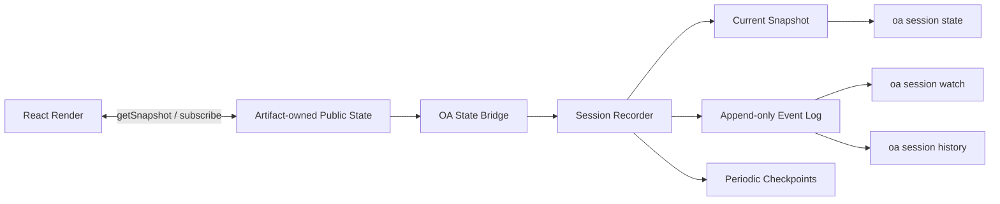

# Artifact State Observation：React 状态历史与 OA 可观察协议调研

> 调研日期：2026-07-18
>
> 研究问题：Agent 如何理解并持续观察一个 React Artifact？React 是否原生提供类似 time machine 的完整状态历史？Open Artifacts 应借鉴哪些现有机制？
>
> 方法：只采用 React、Redux、XState、Immer 的官方文档与源码，以及 IETF RFC 等一手资料。

## 结论

**React 原生不能可靠记录一个页面“所有内部 state”的完整历史。** React 把 `useState` 看作某次 Render 使用的状态快照；它没有公开的全局 `getState()`、`subscribe()`、事件日志或 time-travel API。`<Profiler>` 只报告已经 commit 的 Render 及其耗时，不返回状态值。[React：State as a Snapshot](https://react.dev/learn/state-as-a-snapshot)；[React：Profiler](https://react.dev/reference/react/Profiler)

React DevTools 确实能读取 Fiber 和部分 Hook 状态，但不适合成为 OA 的产品协议。React DevTools 源码会根据 renderer/reconciler 版本选择不同的内部常量，并明确存在 `unsupported-renderer-version` 分支；这说明它是版本耦合的调试实现，而不是 Artifact 作者可以依赖的稳定公共 API。[React DevTools Fiber renderer 源码](https://github.com/facebook/react/blob/main/packages/react-devtools-shared/src/backend/fiber/renderer.js)；[React DevTools hook 源码](https://github.com/facebook/react/blob/main/packages/react-devtools-shared/src/hook.js)

Open Artifacts 应采用的方向不是“抓取 React 内部状态”，而是：

> **Artifact 主动发布一份稳定、JSON 可序列化、Schema 可校验的 Public Artifact State；OA Runtime 记录它的 committed snapshot、语义事件与增量 Patch。**

最值得借鉴的组合是：

```text
Redux       -> 显式 Action、确定性状态转换、可订阅 Store
XState      -> Inspector、Actor/Event/Snapshot、事件溯源
JSON Patch  -> 标准化的结构化增量变更
Immer       -> 自动生成 Patch / inverse Patch 的实现便利
React       -> 通过 useSyncExternalStore 消费外部 Store
```

首版应优先实现“观察当前状态 + 持续变化流 + 历史查询”，不要直接承诺“把任意 React 页面倒回过去”。真正的 time travel 还需要处理副作用、外部资源、版本兼容和非确定性，属于更晚的能力。

## React 本身为什么不是 time machine

### 1. State 是每次 Render 的快照，不是历史日志

React 官方文档说明，State 存在 React 内部；调用组件时，React 给组件的是该次 Render 的状态快照。调用 setter 只是请求下一次 Render，并不会修改当前 Render 已经捕获的值。[React：State as a Snapshot](https://react.dev/learn/state-as-a-snapshot)

这意味着 React 内部掌握“当前工作所需的数据结构”，但不等于它为应用维护了一份可查询、可持久化的业务状态时间线。React 公共 API 没有提供：

- 枚举整个页面所有 Hook State；
- 订阅每个组件的状态变化；
- 查询任意历史版本；
- 将页面恢复到某一个历史版本。

### 2. Render 次数不等于业务状态变更次数

React 允许批处理更新；并发渲染也可以开始、暂停、重新开始或丢弃尚未 commit 的工作。开发环境下，`<StrictMode>` 还会额外调用组件、State updater 和 Effect，以发现不纯逻辑。[React：StrictMode](https://react.dev/reference/react/StrictMode)；[React：Keeping Components Pure](https://react.dev/learn/keeping-components-pure)

因此，“每次组件函数执行都抓一份 state”会混入：

- 从未呈现给用户的 speculative Render；
- Strict Mode 的开发期重复调用；
- 多个 setter 被批处理后产生的中间过程；
- 仅因父组件、Context 或外部 Store 更新而发生的 Render。

OA 真正关心的应是 **committed、具有业务语义的 Public Artifact State**，不是 React 执行引擎的每个瞬时步骤。

### 3. React 状态不只存在于 `useState`

一个页面的实际行为还可能依赖 `useReducer`、Context、外部 Store、URL、DOM、浏览器 API、WebSocket、媒体播放位置以及 `useRef`。`useRef.current` 改变时 React 不会重新 Render，所以仅监听 Render 也看不到全部变化。[React：useRef](https://react.dev/reference/react/useRef)

即使能够遍历 Fiber，也不能自动判断哪些值是业务状态、哪些是缓存、DOM 引用、库内部细节或敏感数据。

### 4. Profiler 只适合性能观察

`<Profiler>` 的 `onRender` 在子树 commit 后触发，并返回 phase、duration、startTime、commitTime 等性能信息。它可以告诉 OA“某一部分刚刚更新”，但不能告诉 OA“`brief.targetPlatform` 从什么变成了什么”。[React：Profiler](https://react.dev/reference/react/Profiler)

## 为什么不应依赖 React DevTools 私有协议

React DevTools 是优秀的开发调试工具，但不应成为 OA Artifact Contract 的底座。

| 风险                      | 一手证据与影响                                                                                                                                                                                                                                       |
| ------------------------- | ---------------------------------------------------------------------------------------------------------------------------------------------------------------------------------------------------------------------------------------------------- |
| 与 React 内部结构耦合     | Fiber renderer 会读取 `memoizedState`、work tags、lanes 等内部字段，并按 reconciler 版本取得内部常量。React 版本变化会改变适配逻辑。[源码](https://github.com/facebook/react/blob/main/packages/react-devtools-shared/src/backend/fiber/renderer.js) |
| 存在版本不兼容            | DevTools hook 在 renderer 无法 attach 时标记 `hasUnsupportedRendererAttached` 并发出 `unsupported-renderer-version`。[源码](https://github.com/facebook/react/blob/main/packages/react-devtools-shared/src/hook.js)                                  |
| 不属于 React 公共状态 API | React 公共文档给出的程序化接口是 State Hook、Profiler 和外部 Store 订阅等；没有把 `__REACT_DEVTOOLS_GLOBAL_HOOK__` 定义成应用协议。DevTools hook 位于 `react-devtools-shared` 的调试实现中。                                                         |
| 语义不稳定                | Fiber/Hook 链只能说明 React 如何保存值，不能说明某个值对 Artifact 的业务含义，也不能稳定命名匿名 Hook。                                                                                                                                              |
| 暴露面过宽                | 遍历全部组件可能意外暴露表单草稿、库缓存、鉴权状态和第三方组件内部数据；OA 无法替 Artifact 作者决定哪些字段可以交给 Agent。                                                                                                                          |
| 生产可用性与成本不确定    | React Profiler 默认不在生产构建启用，DevTools 也以调试为目标；把它变成运行时依赖会引入版本、性能和发布形态约束。[Profiler caveat](https://react.dev/reference/react/Profiler#caveats)                                                                |

可以把 DevTools 当作开发期排障工具，不能把它当成 `oa session state` 的数据源。

## 值得借鉴的现有机制

### Redux：Action log + Store snapshot

Redux 把应用状态集中在 Store 中，通过 `dispatch(action)` 触发 reducer 计算下一状态；Store 提供 `getState()` 和 `subscribe()`。官方文档还明确指出，Action 可以序列化、记录并在以后重放，这正是 time-travel debugger 成立的基础。[Redux：Getting Started](https://redux.js.org/introduction/getting-started/)；[Redux：Store API](https://redux.js.org/api/store/)

Redux 的 Undo History 文档使用统一结构保存 `past / present / future`，同时强调历史记录需要应用主动维护，而不是 UI 框架免费提供。[Redux：Implementing Undo History](https://redux.js.org/usage/implementing-undo-history)

OA 值得借鉴：

- 所有公共变更都有显式 Action/Event；
- 当前状态有统一 `getSnapshot()`；
- Runtime 可订阅 committed 状态；
- 事件是可序列化、可记录、可重放的数据。

OA 不应强制 Artifact 使用 Redux。Artifact 内部可以继续使用原生 React State、Zustand、Redux 或 XState，只需适配统一的 Public State 接口。

### XState：Inspector + Actor/Event/Snapshot

XState v5 的 Inspect API 可以观察 Actor 创建、Actor 间事件、Snapshot 更新和 transition microstep，并为事件提供 root ID、actor reference 和 source reference。[XState：Inspection](https://stately.ai/docs/inspection)

XState 也区分两种持久化方式：保存 `getPersistedSnapshot()`，或持久化事件并通过 replay 恢复状态；官方文档同时提醒状态兼容、Action 副作用和 JSON 序列化限制。[XState：Persistence](https://stately.ai/docs/persistence)

OA 值得借鉴：

- Inspector 是显式接入点，不靠偷看框架内部；
- Event、Snapshot 和生命周期事件是不同对象；
- 每个事件具有 Session/Actor 身份与来源；
- Snapshot persistence 和 event sourcing 是两种不同策略；
- replay 必须承认副作用与版本兼容问题。

### JSON Patch：标准化增量变更

[RFC 6902](https://www.rfc-editor.org/rfc/rfc6902) 定义了 `add`、`remove`、`replace`、`move`、`copy`、`test` 六类操作，可以表达一个 JSON Document 到下一个版本的结构化增量。它适合 OA 在进程、WebSocket 与 CLI 之间传递状态差异。

但 Patch 只回答“数据如何变了”，不回答：

- 谁做的；
- 为什么改；
- 这是草稿、提交还是系统同步；
- 基于哪个版本；
- 是否允许 Agent 回写。

因此 JSON Patch 应被包在 OA Event Envelope 内，而不是独立承担全部协议语义。

### Immer：生成 Patch 的实现工具，而非网络标准

Immer 的 `produceWithPatches()` 可以同时生成正向 Patch 与 inverse Patch，官方列出的用途包括调试、增量同步、undo/redo 和 replay。[Immer：Patches](https://immerjs.github.io/immer/patches/)

但 Immer 官方也说明：

- 它的 `path` 是数组，与 RFC 6902 的 JSON Pointer 字符串不同；
- 生成的 Patch 保证可得到正确结果，但不保证是最小或最优集合。

因此 OA 可以用 Immer 作为 Artifact SDK 的可选实现，Wire Format 仍应规范化为 RFC 6902，或明确声明自己的版本化格式。

### `useSyncExternalStore`：React 与 OA Store 的连接点

React 官方提供 `useSyncExternalStore(subscribe, getSnapshot)` 来消费 React 外部、随时间变化的 Store。React 会通过这两个函数保持订阅并在 Snapshot 变化时更新组件。[React：useSyncExternalStore](https://react.dev/reference/react/useSyncExternalStore)

这给 OA 一个重要启示：Public Artifact State 可以位于 React 之外，由 Artifact 的组件树消费；OA Runtime 同时订阅同一个 Store。这样不需要侵入 Fiber，也不会把 OA 绑定到某个 React 状态库。

## 推荐的 OA 状态观察模型

### 公共状态，而不是全部内部状态

Artifact 作者应主动把状态分成三层：

| 层                      | 示例                                                 | OA 默认行为                                         |
| ----------------------- | ---------------------------------------------------- | --------------------------------------------------- |
| Semantic/Public State   | 当前素材、时间线、已应用 Brief、草稿、选择、播放位置 | 可被 Agent 查询；必须 JSON 可序列化并受 Schema 约束 |
| Ephemeral UI State      | hover、Popover 开关、动画帧、拖拽中间坐标            | 默认不记录；确有协作意义时显式加入                  |
| Private/Sensitive State | Token、用户身份、第三方库缓存、DOM ref               | 禁止进入公共状态；支持字段级 redact                 |

“Agent 能理解页面”不要求 Agent 看见每一个 Hook。它需要看见稳定、有名称、有语义的协作状态。

### 建议的运行链路



Artifact Package 只需要提供稳定适配器；内部使用什么状态库是实现细节。概念接口可以是：

```ts
interface ArtifactStateAdapter<TState, TEvent> {
  getSnapshot(): TState;
  subscribe(listener: (snapshot: TState, event?: TEvent) => void): () => void;
}
```

如果未来允许 Agent 直接改变状态，应增加独立的 `dispatch(command)` 或 capability，不要允许 Agent 任意写 JSON Pointer。读取状态与执行动作是两个不同的权限边界。

### Event Envelope

每次 committed 公共状态变化，OA Runtime 应生成单调递增的 revision，并记录 Snapshot 或 Patch：

```json
{
  "format": "oa.state-event/v0",
  "sessionId": "ses_01...",
  "revision": 12,
  "baseRevision": 11,
  "timestamp": "2026-07-18T10:00:00.000Z",
  "actor": "human",
  "event": {
    "type": "brief.applied"
  },
  "patch": [
    {
      "op": "replace",
      "path": "/brief/active/aspectRatio",
      "value": "9:16"
    }
  ]
}
```

关键字段：

- `revision/baseRevision`：保证排序，并支持检测漏读与乐观并发冲突；
- `actor`：区分 human、agent、artifact、system；
- `event.type`：保留业务意图；
- `patch`：提供机器可读的精确变化；
- `timestamp`：用于展示与审计，不承担排序正确性。

Runtime 应定期保存完整 Snapshot，避免从 Session 开始重放全部 Patch；事件日志负责解释变化，Checkpoint 负责快速恢复。

## “观察历史”与“时间旅行”必须分开

```text
Level 1  Observe current     读取当前 Public State
Level 2  Watch changes       持续接收 committed Event/Patch
Level 3  Inspect history     查询某 revision 的 Snapshot 与变化原因
Level 4  Replay in sandbox   在隔离副本中重放事件
Level 5  Rewind live state   改写正在运行的 Session
```

建议 v0 只做 Level 1–3。它们已经足以让 Agent：

- 准确理解页面当前状态；
- 发现人刚刚改了什么；
- 从断点 revision 继续观察；
- 把批注或后续动作关联到明确版本。

Level 4–5 的困难不在 React State 本身，而在副作用：例如导出文件、网络请求、媒体播放、上传、随机数和当前时间不会因为旧 Snapshot 被恢复而自动撤销。XState 官方的 persistence 文档也明确提醒，Snapshot 恢复不会重新执行已经发生的 Action，而事件重放则需要处理副作用重复执行。[XState：Persistence caveats](https://stately.ai/docs/persistence#caveats)

因此未来如果提供 time travel，应默认在 **read-only sandbox/replay Session** 中运行；Live Session 的撤销应由 Artifact 定义语义明确的 Undo Command。

## 对 Open Artifacts 的阶段建议

### v0：先定义可观察合同

1. Artifact 可选发布 `State Schema` 和 `ArtifactStateAdapter`；
2. State 必须 JSON 可序列化，并允许声明 redact 路径；
3. Runtime 读取当前 Snapshot，分配 revision；
4. 提供一次性读取与持续观察接口；
5. 明确不抓取 Fiber，也不承诺任意 React 内部 State。

候选 CLI 形态：

```bash
oa session state <id> --json
oa session watch <id> --since <revision> --json
```

### v1：历史与变更协议

1. Event Envelope + RFC 6902 Patch；
2. Append-only Event Log + periodic Snapshot checkpoint；
3. `oa session history <id>`；
4. actor、correlation ID、base revision 与 Schema version；
5. 日志容量、采样、脱敏和 Session 清理策略。

### 更晚：动作与回放

1. Artifact 声明可调用 Command 及其 Input Schema；
2. Agent 通过 Command 改变状态，而不是任意 Patch；
3. 在隔离 Session 中 replay；
4. Artifact 自己定义 Undo/Redo 与副作用补偿。

## 最终判断

React DevTools 看起来像现成的“time machine”，但它解决的是开发者调试 React 实现的问题；Open Artifacts 要解决的是 Agent 与人围绕同一业务对象协作的问题。二者的数据边界不同。

最稳妥的产品原则是：

> **OA 只观察 Artifact 主动公开的语义状态；用 Snapshot 回答“现在是什么”，用 Event 回答“为什么变化”，用 Patch 回答“具体哪里变了”，用 Render 回答“人实际看见什么”。**

这样 Agent 获得比截图更准确的理解，又不会让 Artifact Package 绑定 Redux、XState、React Fiber 或某个 DevTools 版本。

## 一手资料

- React：[State as a Snapshot](https://react.dev/learn/state-as-a-snapshot)、[StrictMode](https://react.dev/reference/react/StrictMode)、[Profiler](https://react.dev/reference/react/Profiler)、[useSyncExternalStore](https://react.dev/reference/react/useSyncExternalStore)、[useRef](https://react.dev/reference/react/useRef)
- React DevTools source：[Fiber renderer](https://github.com/facebook/react/blob/main/packages/react-devtools-shared/src/backend/fiber/renderer.js)、[global hook](https://github.com/facebook/react/blob/main/packages/react-devtools-shared/src/hook.js)
- Redux：[Getting Started](https://redux.js.org/introduction/getting-started/)、[Store API](https://redux.js.org/api/store/)、[Implementing Undo History](https://redux.js.org/usage/implementing-undo-history)
- XState：[Inspection](https://stately.ai/docs/inspection)、[Persistence](https://stately.ai/docs/persistence)
- IETF：[RFC 6902 — JSON Patch](https://www.rfc-editor.org/rfc/rfc6902)
- Immer：[Patches](https://immerjs.github.io/immer/patches/)
