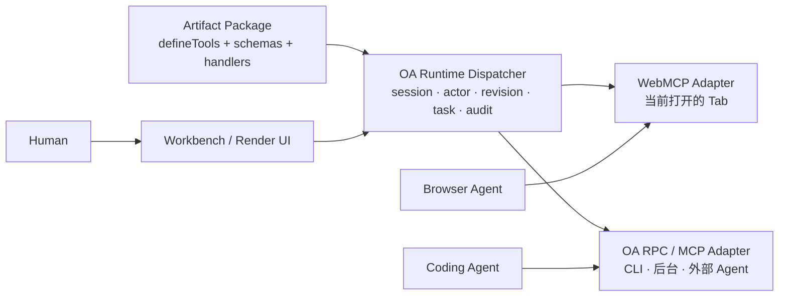
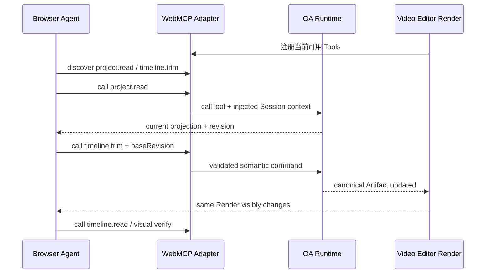

# WebMCP 能否成为 Open Artifacts 的唯一 Agent 交互接口

> 调研日期：2026-07-19
>
> 研究对象：Chrome WebMCP origin trial、Web Machine Learning Community Group 的 WebMCP Draft Community Group Report、MCP 2025-11-25 规范
>
> 研究问题：Open Artifacts 是否可以直接采用 WebMCP，作为 Agent 与 Artifact Render 交互的唯一标准方式？
>
> 资料口径：只引用 Chrome、WebMCP 规范仓库与 MCP 官方规范等一手来源。

## 结论

**WebMCP 很适合成为 Agent 与“当前打开的 Render”交互的首选浏览器 Adapter，但不适合成为 Artifact Package 或 Artifact Session 的唯一标准接口。**

更准确的产品分层是：

> **Artifact Package 定义协议中立的 Capability Contract；OA Runtime 统一执行、记录和治理这些能力；WebMCP 把同一份 Tool Registry 暴露给正在浏览 Render 的 Agent。**



WebMCP 几乎正中 Open Artifacts 的原始愿景：工具直接运行在页面 JavaScript 中，可复用当前页面的 DOM、登录态、Cookie 和实时界面上下文；Agent 的操作发生在用户正在看的同一份 UI 中。Chrome 官方也把它定位为面向 live website、tab-bound、DOM-aware 的前端交互方式。[Chrome：When to use WebMCP and MCP](https://developer.chrome.com/docs/ai/webmcp/compare-mcp)

但 Open Artifacts 还有 WebMCP 明确不覆盖的产品责任：

- `oa run` 启动和停止 Artifact Session；
- 页面尚未打开、已经刷新或关闭后仍能发现与调用能力；
- 为 CLI、Coding Agent、浏览器 Agent 提供一致调用面；
- 读取可订阅的 Artifact Resources；
- revision、并发冲突、actor、审计、长任务与恢复；
- 在不同浏览器和 WebMCP 尚未稳定时保持 Package Contract 可用。

因此推荐的决策是：

| 决策层级                         | 推荐                                    |
| -------------------------------- | --------------------------------------- |
| Artifact Package 的唯一标准      | **不要直接绑定 WebMCP**                 |
| Agent 与已打开 Render 的标准通道 | **优先采用 WebMCP**                     |
| OA 内部能力定义                  | **协议中立的 `defineTools()` Registry** |
| 页面外、后台和 CLI 调用          | **由 OA Runtime 提供另一种 Adapter**    |
| 第一版验证策略                   | **WebMCP-first，但不是 WebMCP-only**    |

## 为什么 WebMCP 与 Open Artifacts 高度契合

### 1. 它让 Agent 操作的是用户正在看的同一份界面

WebMCP Tool 由页面调用 `document.modelContext.registerTool()` 注册，`execute` 回调直接复用页面已有的 JavaScript 逻辑。Chrome 将其描述为访问 live tab 中的 Session 数据、Cookie 和 DOM；Tool 调用可以立即改变当前页面 UI。[Chrome：Imperative API](https://developer.chrome.com/docs/ai/webmcp/imperative-api)；[Chrome：When to use WebMCP and MCP](https://developer.chrome.com/docs/ai/webmcp/compare-mcp)

这比“Agent 调后台 API，用户再刷新页面”更接近 Open Artifacts 想要的人机共同产物：

```text
Human click ─┐
             ├─> 同一个 Domain Handler ─> 同一个 Artifact Session ─> 同一个 Render
Agent tool ──┘
```

### 2. 它提供 Tool 的动态注册、发现与执行

Chrome 当前 Imperative API 支持：

- `registerTool()`：注册 `name`、`description`、`inputSchema`、`execute`；
- `getTools()`：获取当前 Frame Tree 中调用者有权访问的 Tools；
- `executeTool()`：用 JSON 字符串参数调用 Tool；
- `toolchange`：Tool 注册列表变化时通知 Frame；
- `AbortSignal`：注销 Tool，或取消 Chrome 中待处理的 Tool 调用。[Chrome：Imperative API](https://developer.chrome.com/docs/ai/webmcp/imperative-api)

Tool 可以随着页面状态动态出现和消失。例如只有选中一个视频 Item 后才注册 `timeline.trim`，这天然适合复杂编辑器的上下文能力面。[Chrome：WebMCP best practices](https://developer.chrome.com/docs/ai/webmcp/best-practices)

### 3. 它使用浏览器原生的 Origin 与 iframe 权限边界

WebMCP 受 `tools` Permissions Policy 和 Origin Isolation 约束。跨域 iframe 默认不能注册 Tool；Host 必须通过 `allow="tools"` 授权，Tool Owner 还必须用 `exposedTo` 明确允许安全 Origin，调用方也要通过 `fromOrigins` 主动请求跨域 Tool。[Chrome：WebMCP overview](https://developer.chrome.com/docs/ai/webmcp)；[Chrome：Imperative API](https://developer.chrome.com/docs/ai/webmcp/imperative-api)

这对未来将不可信 Artifact Render 放入独立 Origin 的 OA Workbench 很重要，但也意味着 Sandbox 设计必须提前验证：如果 Render 使用跨域或 opaque-origin iframe，不能假设 Workbench 会自动看见其中的 WebMCP Tools。

### 4. Browser Agent 可以在浏览器实现中把 Tool 与视觉观察结合

WebMCP Draft Community Group Report 把浏览器给 Agent 的 Page Observation 定义为 implementation-defined：至少包含 Tool Map，也可以包含截图、Accessibility Tree 等页面信息；观察时机和最终传递格式由浏览器实现决定。[WebMCP Draft Community Group Report：Page observations](https://webmachinelearning.github.io/webmcp/#page-observations)

这恰好符合 OA 的协作闭环：Tool 负责可靠执行语义动作，视觉观察负责证明最终 Render 是否正确。WebMCP 不是 DOM Snapshot API，但它可以与浏览器已有的视觉和可访问性观察互补。

## 为什么它不能成为唯一标准

### 1. 生命周期绑定 Tab，不支持 Headless 或持久后台调用

Chrome 明确列出 WebMCP 的限制：必须打开一个 Tab 或 WebView；没有 Headless 调用支持；Client 必须先访问页面才能发现 Tools。Tool 是 ephemeral 的，导航离开或关闭 Tab 后 Agent 就无法再调用。[Chrome：WebMCP overview](https://developer.chrome.com/docs/ai/webmcp)；[Chrome：When to use WebMCP and MCP](https://developer.chrome.com/docs/ai/webmcp/compare-mcp)

这会直接限制 OA 的以下工作流：

```text
oa CLI 启动 Session，但暂不打开页面     -> WebMCP 不可用
Agent 在后台继续长时间导出              -> Tab 生命周期成为依赖
页面刷新、崩溃或导航                     -> 已注册 Tool 消失
多个 Agent 从不同进程操作同一 Session    -> 没有通用外部传输
Session 恢复后继续调用                   -> 需要重新加载页面与注册
```

如果 Open Artifacts 明确把 v0 产品承诺收窄成“只有页面打开时，浏览器 Agent 与用户共同操作”，WebMCP-only 可以作为实验；它不能支撑更广义的 Artifact Session 合同。

WebMCP 仓库中已经有 Service Worker Tool 的补充提案，但文档仍把 Tool Discovery 与 Just-in-time Installation 标为待解决问题；它不是当前 Chrome WebMCP 能力，不能用来抵消上述限制。[WebMCP Service Worker proposal](https://github.com/webmachinelearning/webmcp/blob/main/docs/service-workers.md)

### 2. Agent 侧的传输与消费方式还没有稳定标准化

截至 2026-07-19，Chrome 文档已经提供 `getTools()` 和 `executeTool()`；但是 2026-07-10 发布的 WebMCP Draft Community Group Report 的 `ModelContext` IDL 仍只有 `registerTool()` 与 `ontoolchange`，没有这两个方法。该规范还明确说，浏览器如何把 Tools 暴露给 Browser Agent 不在 WebMCP 规定范围内，可以使用 MCP、私有 Function Calling 或其他格式。[WebMCP Draft Community Group Report：ModelContext IDL 与 Page observations](https://webmachinelearning.github.io/webmcp/)

这意味着：

- 页面作者注册 Tool 的方向已经比较清楚；
- 任意外部 Agent 如何连接浏览器、定位 Tab、发现 Tool、执行 Tool，还不是跨浏览器的完整传输协议；
- Codex、Claude Code、Cursor 等 Coding Agent 不会因为页面调用了 `registerTool()` 就自动获得这些 Tools；
- OA 仍需要浏览器内置能力、Extension、in-page Agent iframe，或由 OA Runtime 提供的 Bridge。

官方 Explainer 也解释了 WebMCP 为什么没有直接采用完整 MCP：它需要适配 Origin、Browser Permission、DOM 与 Tab 生命周期，同时避免把 Web Platform 绑定到快速变化的后台协议。[WebMCP GitHub Explainer：Alternatives considered](https://github.com/webmachinelearning/webmcp#alternatives-considered)

因此，OA 可以消费 WebMCP，但不能把“浏览器如何把它交给外部 Coding Agent”当作已经解决。

### 3. WebMCP 当前只有 Tools，没有 Resources 与 Artifact 变化订阅

Chrome 官方明确指出，WebMCP 是 MCP-inspired 的 Browser API，并省略了 Resources 等服务端概念。[Chrome：When to use WebMCP and MCP](https://developer.chrome.com/docs/ai/webmcp/compare-mcp)

WebMCP 可以把 `timeline.read`、`captions.read` 建模成 `readOnlyHint: true` 的只读 Tool，因此“Agent 读取当前状态”并非做不到。但当前协议没有：

- `resources/list` / `resources/read`；
- Resource URI 与 Template；
- Resource Update Subscription；
- 从某个 revision 继续获取 Change Feed。

`toolchange` 只表示可用 Tool 列表变化，不表示 Timeline、字幕或批注已经改变。与之相比，MCP Resources 明确定义了 `resources/read`、`resources/subscribe` 和 `notifications/resources/updated`。[MCP 2025-11-25：Resources](https://modelcontextprotocol.io/specification/2025-11-25/server/resources)

所以如果 OA 只采用 WebMCP，Agent 想知道“人刚刚把哪个 Clip 移动了”只能：

1. 反复调用某个只读 Tool；或
2. 由 OA 自己在 Tool 之上另定义 `changes.read(sinceRevision)`。

后者本质上已经是在定义 OA 的 Session 协作协议。

### 4. Schema 与返回值合同还不足以成为稳定 Package ABI

WebMCP 当前 `ModelContextTool` 有 JSON `inputSchema`，但 `execute` 返回的是任意 JavaScript 值。已发布 Draft Community Group Report 没有 `outputSchema`，也没有 MCP 那样标准化的 Text、Image、Audio、Resource Link、Embedded Resource 与 `structuredContent` 结果 Envelope。[WebMCP Draft Community Group Report：ModelContextTool](https://webmachinelearning.github.io/webmcp/#dictdef-modelcontexttool)；[MCP 2025-11-25：Tool Result](https://modelcontextprotocol.io/specification/2025-11-25/server/tools#tool-result)

WebMCP Explainer 仍把以下项目列为 Open Questions：

- 原生 Input/Output Schema Validation；
- `outputSchema`；
- 多模态 Input/Output；
- Streamable Tool Input/Output。[WebMCP GitHub Explainer：Open Questions](https://github.com/webmachinelearning/webmcp#open-questions)

OA 如果要把 Package 当作可版本化、可 Fork、可从 CLI 调用的源码分发单位，不能把这些未稳定部分直接固化为 Package ABI。OA SDK 可以采用与 WebMCP 兼容的字段子集，但应该自己保证 Input/Output 校验和版本兼容。

### 5. 没有 Artifact Session、Actor、Revision 或并发语义

WebMCP 的安全边界主要是 Browser Origin、Frame Tree 和用户已有登录态。规范假设 Agent 可以继承浏览器中的用户身份与 Authentication Context，但 `ToolExecuteCallback` 只收到输入对象；当前 IDL 没有 `sessionId`、`callId`、`actorId`、`baseRevision` 或权限上下文。[WebMCP Draft Community Group Report：Agent baseline capabilities 与 IDL](https://webmachinelearning.github.io/webmcp/)

因此它无法单独回答：

- 这是人、Agent A 还是 Agent B 发起的操作？
- Agent 基于哪个 Artifact revision 修改？
- 人在 Agent 读取后已经改过 Timeline，是否应该拒绝陈旧写入？
- 两个 Tab 或两个 Agent 是否连接同一个 Artifact Session？
- 一次 Tool Call 如何进入审计日志与 Undo 历史？

这些字段不应要求 Agent 自报；OA Runtime 应从 Artifact Session、Connection 和授权上下文注入。

### 6. 异步 Promise 与取消不等于 Durable Task

WebMCP `execute` 可以返回 Promise；Chrome 的 `executeTool()` 可以用 `AbortSignal` 取消一个待处理调用。但当前 WebMCP 没有 durable `taskId`、任务列表、断线后重新查询、进度通知或结果恢复。[Chrome：Imperative API](https://developer.chrome.com/docs/ai/webmcp/imperative-api)

MCP 已单独定义实验性的 Durable Tasks，支持 `tasks/get`、`tasks/result`、`tasks/list`、`tasks/cancel`、TTL 与状态通知；也定义了基于 `progressToken` 的进度通知。[MCP 2025-11-25：Tasks](https://modelcontextprotocol.io/specification/2025-11-25/basic/utilities/tasks)；[MCP 2025-11-25：Progress](https://modelcontextprotocol.io/specification/2025-11-25/basic/utilities/progress)

视频生成、转写和导出不会因为 Tab 刷新就应该丢失。OA Runtime 需要拥有 Task 生命周期，再把短调用或 Task 创建动作映射到 WebMCP Tool。

### 7. Permission 不等于 Approval

WebMCP 已有两类 Annotation：

- `readOnlyHint`：提示 Tool 不修改状态；
- `untrustedContentHint`：提示返回值包含不可信内容。

它们是供 Agent 决策的 Hint，不是可验证的权限或审批合同。WebMCP 安全文档指出，Tool 描述与真实行为之间没有验证保证；Consent Management 仍在讨论中，`requestUserInteraction()` 也处于提案演进状态。[Chrome：WebMCP tool security](https://developer.chrome.com/docs/ai/webmcp/secure-tools)；[WebMCP Draft Community Group Report：Misrepresentation of intent](https://webmachinelearning.github.io/webmcp/#misrepresentation-of-intent)

页面当然可以在 `execute` 内弹出自己的确认 UI，但 OA 仍需统一定义：

- Tool 的风险等级；
- 哪些调用需要确认；
- Proposal、Approval、Reject 的归属和记录；
- Agent 等待确认期间的 Task 状态；
- 审批后是否仍基于原来的 revision。

## 当前能力矩阵

| OA 所需能力                          | WebMCP 截至 2026-07-19                                                   | 判断                      |
| ------------------------------------ | ------------------------------------------------------------------------ | ------------------------- |
| 页面注册语义 Tool                    | `registerTool()`                                                         | ✅ 适合                   |
| Tool 动态增删                        | Registration `AbortSignal` + `toolchange`                                | ✅ 适合                   |
| 页面内发现与执行                     | Chrome 有 `getTools()` / `executeTool()`；标准报告尚未固定 Agent 侧格式  | ⚠️ 可实验，不可当稳定 ABI |
| JSON Input Schema                    | 可声明；原生完整校验仍在讨论                                             | ⚠️ OA 仍应校验            |
| Output Schema                        | 当前 IDL 没有                                                            | ❌ OA 需要补              |
| 结构化结果 / 多模态 / Streaming      | `execute` 返回任意值；多模态与 Streaming 是 Open Question                | ⚠️ 不稳定                 |
| 复用 DOM、Cookie、Live Session State | 直接运行在当前 Document                                                  | ✅ 核心优势               |
| 与截图、Accessibility Tree 联合观察  | Browser Observation 可包含，但由实现决定                                 | ⚠️ 不能作为跨浏览器合同   |
| 页面关闭后调用                       | Tool 随页面消失                                                          | ❌                        |
| Headless / Background                | Chrome 明确不支持 Headless                                               | ❌                        |
| Browser-neutral 外部 Agent Transport | 未规定；依赖 Browser、Extension 或 iframe Agent                          | ❌                        |
| Cross-origin iframe 权限             | Permissions Policy + `exposedTo` + `fromOrigins`                         | ✅ 强，但需显式配置       |
| Artifact Resources                   | 没有 Resource primitive；可暂用只读 Tool                                 | ⚠️ 可绕过但不完整         |
| Resource Watch / Change Feed         | 只有 Tool List 的 `toolchange`                                           | ❌                        |
| Revision / 乐观并发                  | 没有                                                                     | ❌                        |
| Actor / Session / Multi-client       | Browser Auth 隐式继承，无 OA 领域语义                                    | ❌                        |
| Durable Task / Progress / Resume     | Promise + pending call abort，不是 Durable Task                          | ❌                        |
| 统一 Confirmation / Approval         | Hint 与页面自定义 UI；标准 Consent 仍在讨论                              | ⚠️ 不完整                 |
| 成熟度与兼容性                       | Chrome 149 Origin Trial；Draft Community Group Report，不是 W3C Standard | ⚠️ 必须隔离变化           |

## 标准状态与变化风险

截至调研日期：

- Chrome 从 149 开始提供 Origin Trial，本地开发需要开启 `chrome://flags/#enable-webmcp-testing`。[Chrome：WebMCP overview](https://developer.chrome.com/docs/ai/webmcp)
- WebMCP 当前是 **proposed web standard**，Chrome 页面标记为 Intent to Experiment，并明确说明 API 仍在积极讨论、未来可能变化。[Chrome：Imperative API](https://developer.chrome.com/docs/ai/webmcp/imperative-api)
- 2026-07-10 的规范是 Web Machine Learning Community Group 发布的 **Draft Community Group Report**，明确不是 W3C Standard，也不在 W3C Standards Track。[WebMCP Draft Community Group Report：Status](https://webmachinelearning.github.io/webmcp/#sotd)
- Chrome 已经把 `navigator.modelContext` 标记为在 Chrome 150 废弃，转向 `document.modelContext`，说明调用面仍在快速收敛。[Chrome：Imperative API](https://developer.chrome.com/docs/ai/webmcp/imperative-api)
- 当前 Draft Report 的 Declarative WebMCP 章节仍是 TODO；Agent 消费格式和 Page Observation 时机也是 implementation-defined。[WebMCP Draft Community Group Report](https://webmachinelearning.github.io/webmcp/)

这不是拒绝使用 WebMCP 的理由；它是“必须用 Adapter 隔离”的理由。

## 推荐的最小 OA 架构

### 1. Package 作者只定义一次 Tool

Artifact Package 使用 OA SDK 定义协议中立的 Tool Registry。字段可以与 WebMCP/MCP 尽量同构，但 OA 保留自己需要的稳定语义：

```ts
defineTool({
  name: 'timeline.trim',
  description: 'Trim one timeline item',
  inputSchema,
  outputSchema,
  annotations: {
    readOnly: false,
    risk: 'safe',
    idempotent: true,
  },
  async execute(input, context) {
    // context 由 OA Runtime 注入，而不是 Agent 提交
    return context.commit(() => timeline.trim(input));
  },
});
```

Package 不直接调用 `document.modelContext.registerTool()`。否则：

- OA 无法在 Tab 外发现同一 Tool；
- CLI、MCP 和 UI 需要重复定义；
- OA 难以统一做 Schema Validation、Revision、Audit 和 Approval；
- Package Contract 会跟随实验性 Browser API 变化。

### 2. OA Runtime 是唯一 Dispatcher

Runtime 内部保持小而稳定的深接口：

```text
listTools(session)
callTool(session, name, arguments, runtimeContext)
```

`runtimeContext` 由 OA Runtime 注入：

```text
sessionId
callId
actor
baseRevision
authorization
abortSignal
```

Tool 返回领域 Output；Runtime 负责 Output Validation、Revision、Changed Resources、Task、Audit 与错误 Envelope。

### 3. WebMCP Adapter 只负责 Tab 内映射

```ts
for (const tool of dispatcher.listTools(session)) {
  await document.modelContext.registerTool({
    name: tool.name,
    description: tool.description,
    inputSchema: tool.inputSchema,
    annotations: {
      readOnlyHint: tool.annotations.readOnly,
      untrustedContentHint: tool.annotations.untrustedContent,
    },
    execute: (arguments_) =>
      dispatcher.callTool(session, tool.name, arguments_, {
        actor: 'browser-agent',
      }),
  });
}
```

真实实现应由 Adapter 追踪 Tool 动态变化、Feature Detection、API 版本差异与 Frame 权限。上例只表达职责边界。

### 4. 页面外 Adapter 复用同一个 Dispatcher

OA Runtime 还要为 Coding Agent 和 CLI 暴露同一 Registry：

```text
WebMCP Adapter    -> Browser Agent + live Render
OA RPC Adapter    -> oa CLI + external Coding Agent
MCP Adapter       -> 支持 MCP 的 Agent Host
UI Adapter        -> Human click / form interaction
```

不必在第一版同时实现全部 Adapter；关键是 Package Tool Definition 不能从属于其中任何一个。

### 5. Resource 与 Change Feed 独立于 WebMCP

最小版可以把读取建模成 `readOnly` Tools，例如 `timeline.read`、`captions.read`。但 OA 长期仍应定义：

```text
readResource(session, uri)
watchChanges(session, sinceRevision)
```

WebMCP Adapter 可把它们映射成只读 Tools；MCP Adapter 可以映射为 Resources 与 Subscriptions；CLI 可以输出 JSON Lines。这样 OA 的协作语义不会被某个 Transport 的抽象上限限制。

## 可选方案比较

| 方案                                | 优点                                                | 缺点                                                                       | 适用判断               |
| ----------------------------------- | --------------------------------------------------- | -------------------------------------------------------------------------- | ---------------------- |
| A. Artifact Package 直接注册 WebMCP | 代码最少；立即复用 live DOM                         | Chrome/Tab 绑定；外部 Agent、Resource、Task、Revision 均缺失；API 快速变化 | 只适合一次性 Prototype |
| B. OA Registry + WebMCP Adapter     | 同时保留 live UI 优势和协议独立性；可统一审计与并发 | 多一个很薄的 Registry/Dispatcher                                           | **推荐**               |
| C. 只实现后台 MCP Server            | Headless、Resources、Task 能力更完整                | Agent 与当前 UI/DOM 的连接变弱；需要同步 Browser State                     | 不符合 OA 的核心体验   |
| D. 同时手写 WebMCP 与 MCP 两套 Tool | 两端都能用                                          | Schema、名称、Handler 容易漂移                                             | 不推荐                 |

## 建议的第一版验证边界

可以用当前 `artifact-video-editor` 做一个 WebMCP-first Spike，但验证的是 Adapter，而不是把标准写死：

```text
Artifact Tools
├── project.read           [read-only]
├── timeline.read          [read-only]
├── brief.apply            [write]
├── timeline.trim          [write]
├── timeline.split         [write]
└── annotation.create      [write]
```

验证闭环：



Spike 的成功标准：

1. 人的 UI 操作与 WebMCP Tool 复用同一个 Handler；
2. Browser Agent 能发现、调用并看见 Render 变化；
3. Runtime 能记录 `sessionId`、`callId`、actor 与 revision；
4. 页面刷新后 Tools 可以重新注册；
5. 没有 WebMCP 的浏览器仍能正常使用 Render；
6. Tool Registry 可被另一个 Adapter 枚举，证明 Package 没有绑定 WebMCP。

## 最终判断

如果问题是：

> “能否用 WebMCP 取代 Agent 在页面上猜按钮、猜 DOM，然后作为操作当前 Render 的标准方式？”

答案是：**可以，而且非常值得优先采用。**

如果问题是：

> “能否让 Artifact Package 只实现 WebMCP，然后把 OA 的 Session、CLI、后台 Agent、Resource 观察与长期协作都建立在它上面？”

答案是：**不建议。WebMCP 的产品边界就是 live browser page，不是完整的 Artifact Runtime Protocol。**

Open Artifacts 最合适的定位不是重新发明 WebMCP，而是：

> **定义一次 Artifact Capability Contract，由 OA Runtime 将它同时投影成 WebMCP、CLI/MCP 调用和人的 UI 交互；其中 WebMCP 是最贴近“人与 Agent 共享同一 Render”的第一公民 Adapter。**

## 一手资料

- [Chrome：WebMCP overview](https://developer.chrome.com/docs/ai/webmcp)
- [Chrome：Imperative API](https://developer.chrome.com/docs/ai/webmcp/imperative-api)
- [Chrome：When to use WebMCP and MCP](https://developer.chrome.com/docs/ai/webmcp/compare-mcp)
- [Chrome：WebMCP best practices](https://developer.chrome.com/docs/ai/webmcp/best-practices)
- [Chrome：WebMCP tool security](https://developer.chrome.com/docs/ai/webmcp/secure-tools)
- [WebMCP Draft Community Group Report](https://webmachinelearning.github.io/webmcp/)
- [WebMCP GitHub Explainer](https://github.com/webmachinelearning/webmcp)
- [MCP 2025-11-25：Resources](https://modelcontextprotocol.io/specification/2025-11-25/server/resources)
- [MCP 2025-11-25：Tools](https://modelcontextprotocol.io/specification/2025-11-25/server/tools)
- [MCP 2025-11-25：Tasks](https://modelcontextprotocol.io/specification/2025-11-25/basic/utilities/tasks)
- [MCP 2025-11-25：Progress](https://modelcontextprotocol.io/specification/2025-11-25/basic/utilities/progress)
