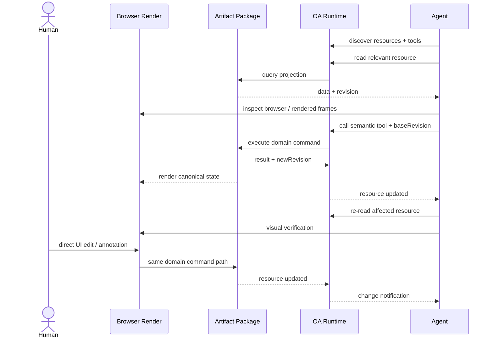

# ChatCut MCP 调用面调研

> 调研日期：2026-07-18
> 对象：ChatCut Codex plugin 0.2.18 的 active MCP manifest
> 目的：从一个已经落地的视频编辑 Agent 接口，反推 Open Artifacts 应向 Agent 暴露什么

## 结论

**Agent 不需要 React 全局 State 的原始快照，但也不能只拥有一组盲写命令。**

ChatCut 当前接口实际采用的是：

> **按任务裁剪的读取面（curated read/query surface） + 语义命令（semantic commands） + 视觉验证（visual verification）**

它用 read_project、read_script、read_captions、find_transcript 等接口让 Agent 先理解当前产物，再通过 edit_item、apply_script 等领域命令修改产物，最后通过结构回读与源素材/合成时间线画面确认结果。[S1][S3][S4]

这也说明问题不应被定义为“全局快照还是 MCP 命令”。更准确的 Open Artifacts 契约是：

> **可发现的资源读取面 + 有 Schema 的语义工具 + revision/change feed + 浏览器视觉表面**

其中 revision/change feed 是 ChatCut 当前工具面尚未通用化解决、但人和 Agent 长期共同编辑同一产物时必须补上的一层。[S1]

## 调研口径与边界

- ChatCut 插件声明版本为 0.2.18，MCP 端点为 `https://api.chatcut.io/api/external-mcp/mcp`，接口能力同时标记为 Read 与 Write。[S2]
- 本文以当前 Codex 会话加载到的 active MCP manifest 及其 tool descriptions/input schemas 为运行时主来源；ChatCut 自己也要求把 active manifest 当作 runtime contract。[S1][S3]
- 当前 Server 的 `resources/list` 只返回一个用于追问表单的 MCP App UI resource：`ui://chatcut/followup-questions-v35`（`name=chatcut-followup-questions`，`mimeType=text/html;profile=mcp-app`）；resource template 为 `ui://chatcut/followup-questions-v{version}{suffix}`。project、timeline、transcript 等产物读取面没有作为 MCP Resources 暴露，而是由 read-only Tools 提供。[S7]
- 本文是**对外接口契约调研**，不是 ChatCut 服务端实现审计；未通过猜测或源码反推隐藏行为。
- 本次尝试对浏览器中打开的项目执行 read_project（view=timeline）两次，均返回：

  > Database pool postgresjs-direct-tool has reached its waiter limit

  因此，本次没有取得该项目的实际响应体，无法验证实时数据内容、延迟和完整性。这个错误只说明当时的数据库连接池不可用，不否定 manifest 中存在 read_project，也不证明其正常运行时的返回内容。[S1]

## 52 个工具的完整接口树

以下分组是为了分析而做的领域归类；工具名称与总数来自 active manifest。[S1]

```text
chatcut MCP (52)
├── 项目生命周期 (8)
│   ├── list_projects
│   ├── create_project
│   ├── target_project
│   ├── get_editor_url
│   ├── edit_project
│   ├── duplicate_project
│   ├── delete_project
│   └── restore_project
│
├── 项目结构与编辑 (10)
│   ├── read_project
│   ├── manage_timelines
│   ├── edit_track
│   ├── edit_item
│   ├── split_item
│   ├── manage_markers
│   ├── manage_media_pool
│   ├── edit_asset
│   ├── manage_template
│   └── manage_design_style
│
├── 脚本、转写与字幕 (8)
│   ├── read_script
│   ├── apply_script
│   ├── clean_script
│   ├── find_transcript
│   ├── manage_transcript
│   ├── read_captions
│   ├── edit_captions
│   └── isolate_voice
│
├── 视觉理解 (2)
│   ├── view_asset_frames
│   └── view_timeline_frames
│
├── 媒体发现、导入与交付 (10)
│   ├── import_media
│   ├── download_media
│   ├── push_asset
│   ├── request_asset_upload_url
│   ├── finalize_uploaded_asset
│   ├── request_asset_download
│   ├── search_stock_media
│   ├── browse_library
│   ├── search_fonts
│   └── web_browser
│
├── 生成与 Motion Graphics (10)
│   ├── create_motion_graphic_from_code
│   ├── convert_motion_graphic_to_video
│   ├── export_motion_graphic_prores
│   ├── register_converted_video
│   ├── submit_music
│   ├── submit_sound
│   ├── submit_voice
│   ├── submit_video
│   ├── submit_shader
│   └── track_progress
│
├── 导出 (2)
│   ├── submit_export
│   └── track_export
│
└── Host 交互与反馈 (2)
    ├── ask_followup_questions
    └── report_user_friction
```

## 能力面

| Agent 要解决的问题              | 代表接口                                                                                                                             | 接口性质        | ChatCut 当前做法                                                                                           | 对 Open Artifacts 的启示                                                       |
| ------------------------------- | ------------------------------------------------------------------------------------------------------------------------------------ | --------------- | ---------------------------------------------------------------------------------------------------------- | ------------------------------------------------------------------------------ |
| 我正在处理哪个产物？            | list_projects、target_project、get_editor_url、manage_timelines                                                                      | 发现 / 定位     | 项目和时间线是显式目标；切换 active timeline 时人的编辑器也会跟随                                          | 产物、分支/视图和会话目标必须可寻址；人的 active view 与 Agent target 最好分离 |
| 产物现在由什么组成？            | read_project                                                                                                                         | 结构读取        | 按 timeline/assets 视图及时间范围、track、item、asset 等条件读取结构；不把转写文本或视觉内容塞进同一个响应 | 不暴露单个巨大 State；提供稳定、可过滤的领域 projection                        |
| 内容表达了什么？                | read_script、read_captions、find_transcript                                                                                          | 语义读取        | 脚本、观众实际看到的字幕分页、原始转写位置与时间线落点分别查询                                             | 同一产物可有多个面向任务的 read model，不必强行归一为一个对象                  |
| 素材本身和最终画面分别是什么？  | view_asset_frames、view_timeline_frames                                                                                              | 视觉读取        | 原始素材帧与合成后时间线帧是两个不同的验证表面                                                             | DOM/结构数据不能替代视觉结果；render 必须是一等公民                            |
| 怎样修改而不理解内部数据布局？  | edit_item、split_item、edit_track、apply_script、edit_captions                                                                       | 语义写入        | 以“添加/更新/删除/切分/应用脚本”等领域动作表达意图，而不是允许任意 patch 整棵状态树                        | Package 应发布语义 command schemas，而不是公开 React store 的写权限            |
| 怎样降低破坏性操作风险？        | apply_script.preview、manage_transcript.preview、edit_item.validateOnly、edit_asset.confirmImpact、submit_export.confirmFontFallback | 局部预演 / 确认 | 只在若干高风险操作上提供预览、验证或影响确认                                                               | 第一版可做 command 级 dry-run；长期需要统一 precondition 与 proposal 协议      |
| 人的批注怎样进入 Agent 工作流？ | manage_markers                                                                                                                       | 结构化批注      | 支持锚定在标尺或 clip 上的点/范围 marker；clip marker 可随移动、裁剪、切分和复制保持关联                   | annotation 应引用稳定领域对象和范围，而不是只保存屏幕坐标                      |
| 长任务怎样跟踪？                | track_progress、track_export                                                                                                         | 轮询            | 通过 wait/poll 跟踪生成与导出                                                                              | 轮询可支撑任务完成，但不是“产物持续变化通知”                                   |
| 怎样证明修改已经生效？          | read_project + view_timeline_frames                                                                                                  | 回读 / 视觉验证 | 结构回读确认对象与帧位置，合成画面确认裁剪、字幕、叠层与最终构图                                           | command 成功响应不是完成证明；应回读受影响资源并验证 render                    |

上述模式也被 ChatCut 插件的操作规范直接强化：修改前先读取新鲜项目状态，修改后用结构与画面两个信号验证，不应把命令返回的 JSON 当作编辑器已经正确反映结果的充分证据。[S3][S4]

## 几个关键接口透露出的设计

### 1. read_project 是结构投影，不是全局状态转储

read_project 可以选择 timeline 或 assets 视图，并通过 timelineId、track、fromFrame/toFrame、itemId、assetId、code 等参数收窄读取范围。它负责 tracks、items、markers、media pool 与 assets 等结构，但不把完整转写文本和视觉内容混进同一个响应。[S1]

这比直接暴露 React store 更适合 Agent：

- 返回值围绕视频编辑领域对象，而不是组件实现；
- 可只读取本次任务相关片段，降低 token 和陈旧状态；
- 前端换 State 管理库或重构组件时，Agent 契约仍可稳定；
- hover、面板宽度、loading、未提交输入等 UI 暂态不会污染领域上下文。

### 2. 语义内容拥有独立读取面

- read_script 提供当前 timeline.md 与源转写文档；apply_script 将编辑后的 timeline.md 与 canonical timeline 做差异并原子应用，并支持 preview。[S1]
- read_captions 返回观众实际看到的字幕分页、样式、布局和 source scope。[S1]
- find_transcript 将一句话映射回源素材时间，并列出它在时间线中的所有放置位置，可请求 word timestamps。[S1]

这说明“当前产物是什么”没有唯一 JSON 答案。结构、脚本、字幕呈现、素材语义分别是为不同任务设计的 projection。

### 3. 写接口表达意图，不暴露任意 State patch

edit_item 用 add/update/delete/ripple 等语义 envelope 批量、原子地修改 item，并支持 validateOnly；apply_script 则让 Agent 通过可读脚本完成结构编辑。[S1] 即使某些子 payload 保留扩展字段，它们仍然处在具体领域动作之内，而不是“提交任意 React State”。

### 4. 视觉验证是独立证据

view_asset_frames 用于理解原始素材，view_timeline_frames 用于观察经过裁剪、缩放、字幕、叠层和效果之后的最终合成。ChatCut 的验证规范也明确区分源素材理解与时间线结果证明。[S1][S4]

因此，Open Artifacts 的网页不是 State 的装饰性镜像，而是 Agent 和人共同判断产物结果的视觉表面。

## 当前工具面明确没有通用解决的部分

以下判断严格限定为“本次可见的 52 个 active tool schemas 中没有发现”，不等同于断言 ChatCut 内部完全不存在相关机制。[S1]

| 缺失的通用契约                          | 当前能看到的局部能力                                         | 为什么仍不够                                                                                 |
| --------------------------------------- | ------------------------------------------------------------ | -------------------------------------------------------------------------------------------- |
| revision / baseRevision / ETag          | apply_script 在 read_script 之后有隐式陈旧保护               | Agent 不能统一声明“我基于版本 N 修改”，难以可靠发现人与 Agent 并发冲突                       |
| 通用 change feed / watch / subscription | track_progress、track_export 可轮询单个任务                  | 只能等某项任务，不能知道人在 UI 中刚修改了哪个领域资源                                       |
| actor / presence                        | 用户身份由 connector auth 隐式取得；active timeline 会被共享 | 无法回答谁正在看、谁在编辑、Agent 的关注范围在哪里                                           |
| proposal / approval                     | 个别接口有 preview、validateOnly 或 confirm 参数             | 没有统一的“提案 → 人审阅 → 批准/拒绝 → 应用”对象和生命周期                                   |
| 通用 undo / redo / time machine         | restore_project 可恢复软删除项目；少数接口可 clear           | 没有跨命令的统一 inverse、历史版本或状态回放                                                 |
| 可订阅的产物资源更新                    | MCP Resources 只有 follow-up form UI resource                | project/timeline/transcript 没有资源订阅面；Agent 空闲期间无法持续观察产物变化，只能再次查询 |

由此可见，**ChatCut 已经很好地覆盖单轮执行闭环，但还不能直接作为 Open Artifacts 长期人机协作协议的完整模板。**

## MCP 也不是 commands-only

MCP 官方规范本身把“操作”和“上下文”拆成两种 server feature：

- **Tools**：由模型控制，通过 tools/list 发现、tools/call 调用；每个 Tool 有 inputSchema，并可声明 outputSchema，还能返回 resource links 或 embedded resources。[S5]
- **Resources**：由应用控制，通过 resources/list、resources/read 和 resource templates 暴露上下文；Server 还可选支持 resources/subscribe 与 notifications/resources/updated。[S6]

所以“像 MCP 一样”不应被缩减为“只有命令”。MCP 的原生抽象已经允许：

```text
Resources  = Agent 可读取、可订阅的上下文
Tools      = Agent 可调用的语义动作
Render     = 人与 Agent 共同验证的视觉结果（由 Open Artifacts 补成一等表面）
```

ChatCut 的实现是明确的 **tool-centric surface**：project、timeline、transcript 等产物状态都通过 read_project、read_script、view_timeline_frames 等 read-only Tools 查询；唯一的 MCP Resource 是 ask_followup_questions 使用的 HTML 表单 UI，不承载产物状态。[S1][S7]

因此，“它主要暴露 Tools”也不等于“Agent 只需要写命令”。**语义上，ChatCut 仍由读工具与写工具共同组成闭环。** 对 Open Artifacts 来说，稳定、可订阅的产物读取面可优先建模为 Resources；高度参数化的查询也可以保留为 read-only Tools。重要的不是拘泥于 MCP 类型，而是不能丢失可查询、可验证的 read surface。

## 对 Open Artifacts 的建议

### 不需要与仍然需要的 State

| 能力                         |     是否需要 | 建议                                                                                      |
| ---------------------------- | -----------: | ----------------------------------------------------------------------------------------- |
| 完整 React/global State 快照 |           否 | 不把组件树、store、hover/loading/layout 等实现细节作为 Agent 协议                         |
| 按领域裁剪的当前资源快照     |           是 | 例如 project、timeline、asset、transcript、captions、annotations、renderFrames            |
| 语义 Command / Tool          |           是 | 用 JSON Schema 描述 trim、split、caption.update、annotation.create、export.request 等动作 |
| revision 与变更通知          | 协同场景需要 | 每个读取结果携带 revision；命令可带 baseRevision；资源变化可订阅                          |
| 浏览器视觉表面               |           是 | 人直接操作，Agent 通过 browser use 或 render frame 验证                                   |
| 全量 Time Machine            | 第一版不需要 | 先保留 revision/event 基础；需要审计、撤销或回放时再派生完整历史体验                      |

核心改名建议：不要把 Agent 所需能力称为 Public React State，可称为：

> **Agent-facing Resource Model（面向 Agent 的资源模型）**

它允许“当前快照”，但快照是稳定、可查询、可分页的领域 projection，而不是前端实现的整棵状态树。

### 建议的最小协作闭环

下面的 baseRevision 与 change notification 是 Open Artifacts 的建议能力，不是对 ChatCut 现状的描述。



这个闭环的关键不是记录每一次 React setState，而是让人和 Agent：

1. 读取同一份 canonical artifact 的任务相关 projection；
2. 通过同一套领域命令修改它；
3. 通过 revision/change feed 知道对方刚刚改了什么；
4. 在同一个 render 上验证结果。

## 建议的阶段边界

### 第一版

- Package 声明可读取的 Resources 与可调用的 Tools；
- Resource 返回当前 projection 与 revision；
- Tool 接收 JSON Schema 参数，可选 baseRevision；
- 人的 UI 操作复用同一领域命令路径；
- Agent 可回读资源，并通过浏览器或 render frames 验证。

### 后续演进

- resource update subscription / change feed；
- presence 与“Agent 正在查看这里”的浮层；
- proposal / approval；
- annotation 的稳定领域锚点；
- 基于 event/revision 历史派生 undo、审计和 Time Machine。

**因此，Time Machine 不是 Agent 协作的第一性能力；可查询资源、语义命令、并发版本与变化通知才是。** Time Machine 可以在这些基础之上演进，而不应成为 Package 第一版必须暴露完整前端状态历史的理由。

## 来源

| 编号 | 主来源                                                                                                                                         | 用途                                                                                       |
| ---- | ---------------------------------------------------------------------------------------------------------------------------------------------- | ------------------------------------------------------------------------------------------ |
| S1   | 当前 Codex 会话加载的 ChatCut active MCP manifest（2026-07-18 检视，共 52 个 tool descriptions/input schemas）                                 | 工具全集、参数语义、读取/写入/预演能力与缺失项。该 manifest 是运行时主来源，不是本仓库文件 |
| S2   | `~/.codex/plugins/cache/chatcut-inc/chatcut/0.2.18/.codex-plugin/plugin.json` 与 `~/.codex/plugins/cache/chatcut-inc/chatcut/0.2.18/.mcp.json` | 插件版本、Read/Write 能力声明与 MCP endpoint                                               |
| S3   | `~/.codex/plugins/cache/chatcut-inc/chatcut/0.2.18/skills/chatcut-plugin-basics/SKILL.md`                                                      | active manifest 是 runtime contract、项目模型、修改前读取、浏览器编辑器是 live workbench   |
| S4   | `~/.codex/plugins/cache/chatcut-inc/chatcut/0.2.18/skills/verification/SKILL.md`                                                               | 结构回读与视觉验证的双信号，以及源素材与合成结果的边界                                     |
| S5   | [MCP Specification 2025-11-25 — Tools](https://modelcontextprotocol.io/specification/2025-11-25/server/tools)                                  | tools/list、tools/call、Schema、model-controlled 与 Tool 返回内容                          |
| S6   | [MCP Specification 2025-11-25 — Resources](https://modelcontextprotocol.io/specification/2025-11-25/server/resources)                          | resources/list/read/templates、application-controlled 与可选资源更新订阅                   |
| S7   | 当前 ChatCut MCP Server 的 resources/list 与 resources/templates/list（2026-07-18 实测）                                                       | 当前仅有 follow-up questions MCP App UI resource；项目领域读取仍走 read-only Tools         |
